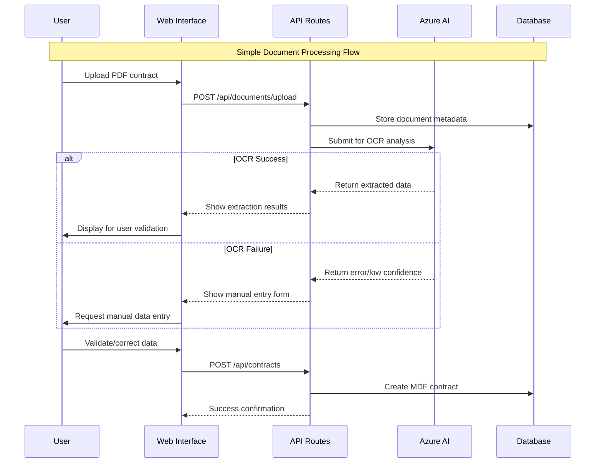
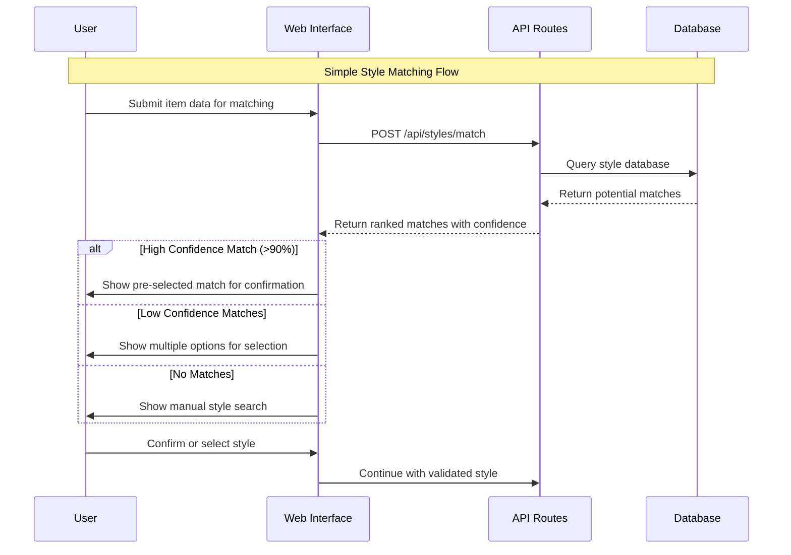

# Core Workflows

Simple workflow patterns focusing on reliability and user control over automation complexity.

## Document Processing Workflow

```mermaid
sequenceDiagram
    participant U as User
    participant UI as Web Interface
    participant API as API Routes
    participant AZ as Azure AI
    participant DB as Database

    Note over U,DB: Simple Document Processing Flow
    U->>UI: Upload PDF contract
    UI->>API: POST /api/documents/upload
    API->>DB: Store document metadata
    API->>AZ: Submit for OCR analysis
    
    alt OCR Success
        AZ-->>API: Return extracted data
        API-->>UI: Show extraction results
        UI->>U: Display for user validation
    else OCR Failure
        AZ-->>API: Return error/low confidence
        API-->>UI: Show manual entry form
        UI->>U: Request manual data entry
    end
    
    U->>UI: Validate/correct data
    UI->>API: POST /api/contracts
    API->>DB: Create MDF contract
    API-->>UI: Success confirmation
```

## Style Matching Workflow

```mermaid
sequenceDiagram
    participant U as User
    participant UI as Web Interface
    participant API as API Routes
    participant DB as Database

    Note over U,DB: Simple Style Matching Flow
    U->>UI: Submit item data for matching
    UI->>API: POST /api/styles/match
    API->>DB: Query style database
    DB-->>API: Return potential matches
    API-->>UI: Return ranked matches with confidence
    
    alt High Confidence Match (>90%)
        UI->>U: Show pre-selected match for confirmation
    else Low Confidence Matches
        UI->>U: Show multiple options for selection
    else No Matches
        UI->>U: Show manual style search
    end
    
    U->>UI: Confirm or select style
    UI->>API: Continue with validated style
```
