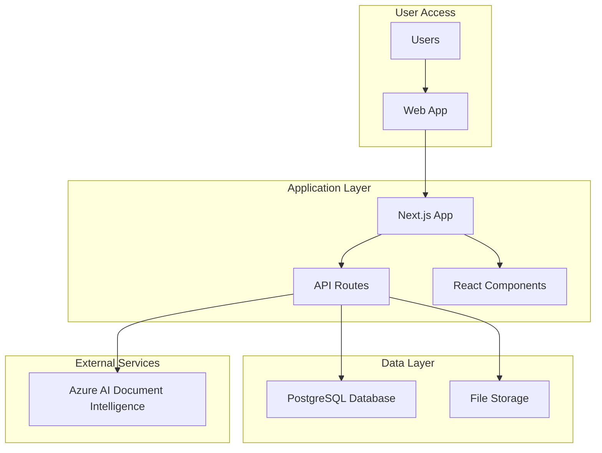

# High Level Architecture

## Technical Summary

The MDF Contract Management System follows a straightforward fullstack architecture using Next.js with standard PostgreSQL database, deployed on standard hosting infrastructure. The system integrates Azure AI Document Intelligence for reliable OCR processing with manual fallback, and implements simple Style matching with user validation. The architecture emphasizes reliability and maintainability over real-time features or complex orchestration.

## Platform and Infrastructure Choice

**Platform:** Next.js + Standard PostgreSQL + Standard Web Hosting
**Key Services:** Next.js hosting, PostgreSQL database, Azure AI Document Intelligence
**Deployment Host:** Standard cloud hosting (AWS/GCP/Azure) with managed PostgreSQL

## Repository Structure

**Structure:** Simple Monorepo
**Package Organization:** Single Next.js app with shared utilities and types

## High Level Architecture Diagram

## Architectural Patterns

- **Standard Web App Architecture:** Server-side rendering with API routes for backend logic
- **Component-Based UI:** Simple React components with TypeScript for type safety
- **Append-Only Ledger Pattern:** Immutable financial transaction records for audit integrity
- **Single OCR Provider:** Azure AI with manual fallback for reliability over complexity
- **Manual Refresh Pattern:** On-demand data updates instead of real-time complexity
