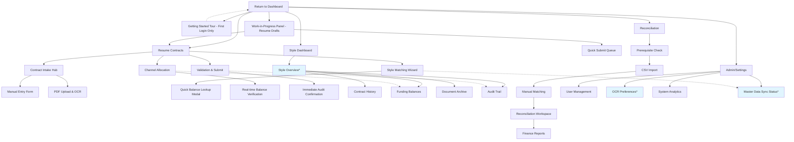
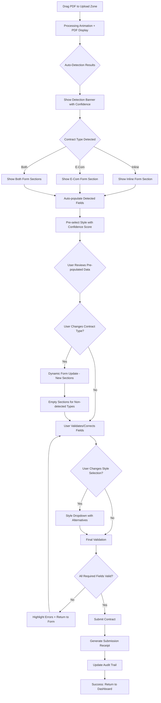

# MDF Contract Management System UI/UX Specification

This document defines the user experience goals, information architecture, user flows, and visual design specifications for MDF Contract Management System's user interface. It serves as the foundation for visual design and frontend development, ensuring a cohesive and user-centered experience.

## Overall UX Goals & Principles

### Target User Personas

- **Operations Processor:** Arkansas Operations team members processing 10+ contracts daily, needing speed with accuracy validation
- **Finance Reconciler:** Finance team members doing monthly reconciliation, requiring clear matching interfaces and audit trails  
- **Sales Stakeholder:** Seeking quick funding status answers, needing simple dashboards and on-demand funding visibility

### Usability Goals

- **Processing Efficiency:** Reduce contract processing from 3-5 days to 1-2 days through intuitive workflows
- **Error Prevention:** Achieve <2% error rate through confidence-based AI assistance and validation checkpoints
- **Quick Status Queries:** Sales stakeholders get funding status instantly via manual refresh dashboard
- **Cognitive Load Reduction:** Side-by-side layouts minimize context switching during validation tasks

### Design Principles

1. **Confidence Through Transparency** - Show AI confidence scores and reasoning to build user trust
2. **Contextual Validation** - Always provide document context alongside extracted data for informed decisions
3. **Progressive Disclosure** - Reveal complexity only when needed (e.g., channel splits, reconciliation details)
4. **Status-Driven Design** - Clear visual indicators guide users through processing states
5. **Audit-First Approach** - Every action creates visible audit trails for compliance confidence

### Change Log
| Date | Version | Description | Author |
|------|---------|-------------|---------|
| 2025-08-31 | v1.0 | Initial UI/UX specification creation | Sally (UX Expert) |

## Information Architecture (IA)

### Site Map / Screen Inventory

### Navigation Structure

**Primary Navigation:** Tab-based navigation with enhanced status awareness:
- **Process Contracts (3)** - Work count with quick resume access  
- **Style Dashboard** - Real-time funding visibility  
- **Reconciliation** - Finance workflow with prerequisite validation
- **Admin** - Settings with system status indicators

**Onboarding Navigation:** Getting Started tour is a one-time guided experience for new users, accessible via:
- Automatic trigger on first login
- Help menu "Take Tour Again" option  
- User profile settings for re-activation

**Secondary Navigation:** Intelligent workflow progression:
- **Contract Processing:** Wizard-style steps with save/resume capability and iterative Style↔Channel flow
- **Style Dashboard:** Hierarchical navigation enforcing Overview-first approach with contextual drill-downs
- **Reconciliation:** Sequential workflow with prerequisite checking and clear dependencies
- **Admin:** Organized by user impact with critical settings (*marked) promoted to relevant workflows

**Breadcrumb Strategy:** Context-preserving navigation showing Style context, workflow position, and cross-area dependencies. Includes "Return to [Previous Context]" links when jumping between primary areas during multi-step workflows.

## User Flows

### Contract Processing Flow

**User Goal:** Process a new MDF contract from PDF upload through final system submission

**Entry Points:** 
- Dashboard "Process New Contract" button
- Work-in-Progress panel "Resume Draft" 
- Direct URL bookmark to Contract Intake Hub

**Success Criteria:** 
- Contract data accurately extracted and validated
- Style properly matched with ≥90% confidence or user-confirmed
- Channel allocations correctly specified
- Submission receipt generated with audit trail

#### Flow Diagram

#### Edge Cases & Error Handling:
- **PDF corruption or unreadable format:** Fallback to manual entry with clear error messaging
- **OCR timeout or service failure:** Graceful degradation to basic text extraction or manual entry
- **Style matching returns zero results:** Manual search interface with "create new Style request" escalation
- **Network failure during submission:** Auto-save draft with retry mechanism and offline indication
- **Concurrent user editing same contract:** Version conflict detection with merge assistance
- **Invalid channel allocation amounts:** Real-time validation with clear error descriptions

**Notes:** The flow emphasizes user agency at each validation point while providing intelligent assistance. Critical decision points (Style confirmation, channel allocation) require explicit user action rather than automatic progression. Error recovery paths maintain user progress and provide clear next actions.

## Wireframes & Mockups

**Primary Design Files:** Figma workspace organized as follows:
- **01-Design System** - Color palette, typography, components library
- **02-User Flows** - Interactive prototypes linking key screens  
- **03-Screen Designs** - High-fidelity mockups for development handoff
- **04-Mobile Responsive** - Tablet and mobile adaptations
- **05-Component Specs** - Detailed component documentation and states

### Key Screen Layouts

**Note:** Mobile layouts focus on status checking and alerts only - no form processing interfaces designed for mobile due to financial accuracy requirements.

#### Streamlined Contract Intake Screen

**Purpose:** Single-screen contract processing with PDF reference and intelligent auto-detection

**Key Elements:**
- **Left Panel (40%):** Collapsible PDF viewer with text highlighting showing detected fields
- **Right Panel (60%):** Dynamic form sections that appear based on contract detection results
- **Top Detection Banner:** Shows detected contract type with confidence score
- **Contract Type Controls:** Toggle buttons for Inline/E-Com/Both with dynamic form updates
- **Style Selection Widget:** Pre-selected Style with confidence indicator and dropdown alternatives

**Interaction Notes:** 
- PDF drag-drop transforms into reference viewer with highlighted detected text
- Form sections appear dynamically based on auto-detection (Inline, E-Com, or Both)
- User can toggle contract types - new sections open empty if not detected
- PDF panel provides verification reference while maintaining streamlined workflow
- Style pre-selection with confidence score integrated into main form flow

**Design File Reference:** Contract-Intake-Streamlined.fig → Frame "Detection-Driven Processing"

#### Style Matching Widget (Integrated)

**Purpose:** Confidence-based Style attribution integrated into main processing flow

**Key Elements:**
- **Pre-selected Style Display:** "FAM12345 (92% confidence match)" with edit icon
- **Dropdown Alternatives:** List of alternative Styles with confidence scores when expanded
- **OCS Status Indicator:** Active/Inactive contract linkage status with warning icons
- **Manual Search Fallback:** Autocomplete search when confidence is low or user overrides

**Interaction Notes:**
- Style appears pre-selected based on auto-detection confidence
- Dropdown shows ranked alternatives with reasoning when user clicks to change
- OCS warnings appear inline for inactive or mismatched contracts
- Manual search reveals for low-confidence matches or user preference

**Design File Reference:** Style-Widget-Integrated.fig → Frame "Confidence-Based Inline Selection"

#### Dynamic Form Sections

**Purpose:** Adaptive form layout that responds to contract type detection and user selection

**Key Elements:**
- **Inline Section:** Appears when Inline detected/selected with pre-populated fields
- **E-Com Section:** Appears when E-Com detected/selected with detected data or empty if user-added
- **Both Channels View:** Shows both sections when hybrid contract detected or user selects Both
- **Field Validation:** Real-time validation with clear error states and formatting
- **Auto-save Indicators:** Progress indicators showing draft status and last saved

**Interaction Notes:**
- Sections show/hide dynamically based on detection results and user toggles
- Pre-populated fields allow user override and correction
- Empty sections appear when user adds contract type not detected by system
- Independent validation for each channel with separate amount requirements

**Design File Reference:** Dynamic-Forms.fig → Frame "Adaptive Section Layout"

#### Style-Centric Dashboard

**Purpose:** Real-time funding visibility and operational status monitoring

**Key Elements:**
- **Style Cards Grid:** Each card shows Style Number, current balance, and status indicators
- **Filter Toolbar:** Search, season selector, business line filter, channel toggle
- **Quick Actions Bar:** Process new contract, view pending work, reconciliation status  
- **Status Legend:** Color-coded indicators for Active/Closed/Finalized contract states
- **Balance Summary:** Total committed vs. reconciled amounts with variance indicators

**Interaction Notes:**
- Cards expand on hover to show mini-summary without navigation
- Click-through to detailed Style view with contract history
- Manual refresh balance updates with clear refresh indicators and last-updated timestamps
- Responsive grid adapts to screen size maintaining readability

**Design File Reference:** Style-Dashboard-Grid.fig → Frame "Main Dashboard View"

## Component Library / Design System

**Design System Approach:** Custom component library optimized for financial data entry and workflow applications, with Next.js/React components built for reusability and consistency. Focus on form components, confidence indicators, status widgets, and data visualization elements specific to contract processing workflows.

### Core Components

#### Confidence Score Widget

**Purpose:** Display AI confidence scores with consistent visual indicators across Style matching and detection results

**Variants:** 
- **Inline Badge:** Small percentage with color coding (≥90% green, 70-89% yellow, <70% red)
- **Detailed Card:** Expanded view with reasoning text and confidence bar
- **Mini Indicator:** Dot-style indicator for dashboard cards and lists

**States:** Loading (animated), High Confidence (green), Medium Confidence (yellow), Low Confidence (red), Error (gray with warning icon)

**Usage Guidelines:** Always pair confidence scores with user action capability - never show confidence without allowing user override or review

#### Contract Type Toggle

**Purpose:** Multi-state toggle for Inline/E-Com/Both channel selection with dynamic form integration  

**Variants:**
- **Single Select:** Radio button style for exclusive selection
- **Multi Select:** Checkbox style allowing Both Channels combination  
- **Detection Override:** Shows detected state with manual override capability

**States:** Detected (blue outline), User Selected (solid color), Available (default), Disabled (grayed)

**Usage Guidelines:** When user changes selection, connected form sections should animate in/out with smooth transitions. Both Channels selection should clearly indicate two separate commitments.

#### Dynamic Form Section

**Purpose:** Collapsible form sections that appear/disappear based on contract detection and user selection

**Variants:**
- **Detected Section:** Pre-populated with extracted data, highlighted fields
- **Manual Section:** Empty fields when user adds non-detected contract type  
- **Validation Section:** Error states with inline messaging and correction guidance

**States:** Hidden, Expanding (animation), Active, Validating, Error, Success

**Usage Guidelines:** Sections should maintain scroll position when expanding/collapsing. Auto-save should trigger on field changes with visible confirmation.

#### Style Selection Dropdown  

**Purpose:** Searchable dropdown with confidence scoring for Style Number selection and alternatives

**Variants:**
- **Pre-selected:** Shows detected Style with confidence badge
- **Search Mode:** Autocomplete with filtering by season, business line  
- **Alternative List:** Ranked alternatives with reasoning when expanded

**States:** Loading, Pre-selected, Searching, Results Available, No Results, Error

**Usage Guidelines:** Pre-selected option should be clearly marked as AI suggestion. Manual search should be easily accessible. OCS status indicators required for compliance validation.

#### Status Indicator Badge

**Purpose:** Consistent status visualization across contracts, Styles, and reconciliation states

**Variants:**
- **Contract Status:** Active (green), Closed (yellow), Finalized (blue)
- **Balance Status:** Available (green), Low (yellow), Overdrawn (red)  
- **Processing Status:** Draft (gray), Processing (blue), Complete (green), Error (red)

**States:** Static display, Animated (for manual refresh updates), Interactive (clickable for details)

**Usage Guidelines:** Color coding must meet accessibility contrast requirements. Include text labels alongside color indicators. Animation should be subtle for balance updates.

## Branding & Style Guide

### Visual Identity

**Brand Guidelines:** Clean, professional interface reflecting enterprise financial software standards with emphasis on clarity and trust through consistent typography, appropriate use of color for status indicators, and integration with FAMBrands visual identity where appropriate.

### Color Palette

| Color Type | Hex Code | Usage |
|------------|----------|-------|
| Primary | #1E40AF | Primary actions, navigation highlights, focus indicators |
| Secondary | #6366F1 | Secondary buttons, links, accent elements |
| Accent | #059669 | Success states, positive balances, completed actions |
| Success | #10B981 | Confirmations, validation success, active contracts, confidence indicators ≥90% |
| Warning | #F59E0B | Attention needed, medium confidence 70-89%, pending states |
| Error | #EF4444 | Errors, critical alerts, confidence <70%, overdrawn balances |
| Neutral | #6B7280, #F3F4F6, #E5E7EB | Text, borders, backgrounds, disabled states |

### Typography

#### Font Families
- **Primary:** Inter (web-safe, excellent for data-heavy interfaces)
- **Secondary:** Source Sans Pro (fallback, high legibility for forms)
- **Monospace:** JetBrains Mono (for Style numbers, amounts, technical data)

#### Type Scale
| Element | Size | Weight | Line Height |
|---------|------|---------|------------|
| H1 | 32px | 600 | 1.25 |
| H2 | 24px | 600 | 1.33 |
| H3 | 20px | 500 | 1.4 |
| Body | 16px | 400 | 1.5 |
| Small | 14px | 400 | 1.43 |

### Iconography

**Icon Library:** Heroicons v2 (consistent with Tailwind CSS ecosystem, professional appearance)

**Usage Guidelines:** Icons should be 16px or 20px for inline use, 24px for standalone actions. Use outline style for default states, solid style for active/selected states. Confidence indicators use custom percentage badges with color coding.

### Spacing & Layout

**Grid System:** 12-column CSS Grid with 24px gutters, responsive breakpoints at 768px (tablet) and 1024px (desktop)

**Spacing Scale:** 4px base unit - 4px, 8px, 12px, 16px, 24px, 32px, 48px, 64px for consistent spacing throughout the interface

## Accessibility Requirements

**Compliance Target:** WCAG 2.1 AA standard ensuring keyboard navigation, screen reader compatibility, color contrast ratios, and alternative text for all visual elements, critical for users with diverse accessibility needs in operations environment.

### Key Requirements

**Visual:**
- Color contrast ratios: 4.5:1 minimum for normal text, 3:1 for large text and UI components
- Focus indicators: 2px solid outline with 2px offset, high contrast color (#1E40AF) visible on all interactive elements
- Text sizing: Minimum 16px for body text, scalable to 200% without horizontal scrolling

**Interaction:**
- Keyboard navigation: All interactive elements accessible via Tab, Enter, Space, and Arrow keys with logical tab order
- Screen reader support: Semantic HTML, ARIA labels for complex widgets, live regions for dynamic updates
- Touch targets: Minimum 44px x 44px clickable areas for tablet dashboard interfaces

**Content:**
- Alternative text: Descriptive alt text for all images, charts, and visual indicators including confidence scores
- Heading structure: Logical H1-H6 hierarchy for screen reader navigation, skip links to main content
- Form labels: Explicit labels for all form inputs, error messaging associated with relevant fields

### Testing Strategy

Automated accessibility testing integrated into CI/CD pipeline using axe-core, manual testing with keyboard navigation and screen readers (NVDA, JAWS), regular accessibility audits during development sprints, and user testing with accessibility-dependent users during beta phase.

## Responsiveness Strategy

**Strategic Focus:** Desktop-first approach recognizing that 95% of contract processing occurs at workstations, with simplified tablet/mobile interfaces for monitoring only - no financial processing on inadequate devices.

### Breakpoints

| Breakpoint | Min Width | Max Width | Target Devices |
|------------|-----------|-----------|----------------|
| Mobile | 320px | 767px | Phones for alerts and basic balance lookup only |
| Tablet | 768px | 1023px | iPads for dashboard monitoring and status review only |
| Desktop | 1024px | 1439px | Primary workstations for all contract processing |
| Wide | 1440px | - | Large monitors for power users and multi-contract workflows |

### Adaptation Patterns

**Layout Changes:** 
- **Desktop/Wide:** Full-featured side-by-side PDF + form layout optimized for accuracy and efficiency
- **Tablet:** Read-only dashboard with charts, balances, and contract status - no form entry or processing
- **Mobile:** Basic balance lookup interface with alerts and notifications acknowledgment

**Navigation Changes:** 
- **Desktop/Wide:** Complete navigation with all processing workflows accessible
- **Tablet:** Simplified dashboard navigation focused on monitoring and reporting
- **Mobile:** Minimal interface for quick status checks and alert management

**Content Priority:** 
- **Desktop/Wide:** Complete feature set with comprehensive contract processing capabilities
- **Tablet:** Monitoring only - Style dashboard, balance visibility, status tracking, audit trail viewing
- **Mobile:** Critical information only - balance queries, funding alerts, basic contract status

**Interaction Changes:**
- **Desktop/Wide:** Mouse/keyboard optimized with full processing workflows and detailed validation
- **Tablet:** Touch-optimized viewing with drill-down capabilities but no data entry
- **Mobile:** Thumb-friendly status checking with swipe navigation and push notification handling

**Rationale for Simplified Approach:** Financial contract processing requires full document context, detailed validation, and audit trail creation that cannot be safely accomplished on smaller screens. This focused strategy ensures development resources prioritize the primary desktop workflow while providing appropriate monitoring capabilities for management and emergency status checks.

## Animation & Micro-interactions

### Motion Principles

**Purposeful Motion Only:** Every animation must serve a functional purpose - indicating progress, confirming actions, or guiding user attention. No decorative animations that distract from financial accuracy requirements.

**Performance First:** All animations must maintain 60fps performance and can be disabled via user preferences or `prefers-reduced-motion` CSS media query for accessibility compliance.

**Professional Restraint:** Subtle, business-appropriate motion that builds confidence rather than drawing attention to interface cleverness.

### Key Animations

- **Form Section Expand/Collapse:** Smooth height transition when contract type toggles reveal/hide sections (Duration: 200ms, Easing: ease-out)
- **Confidence Score Updates:** Gentle fade-in for new confidence percentages during Style matching (Duration: 150ms, Easing: ease-in-out)  
- **Balance Change Indicators:** Subtle pulse animation for balance updates in dashboard (Duration: 150ms, Easing: ease-in-out)
- **PDF Processing Progress:** Linear progress bar with smooth fill animation during OCR extraction (Duration: based on actual progress, Easing: linear)
- **Validation State Transitions:** Color and icon changes for form field validation with smooth transitions (Duration: 100ms, Easing: ease-out)
- **Success Confirmation:** Brief check mark animation on successful contract submission (Duration: 250ms, Easing: ease-out)
- **Loading States:** Skeleton screens for dashboard cards and form loading with subtle shimmer effect (Duration: 1500ms loop, Easing: ease-in-out)

## Performance Considerations

### Performance Goals

- **Page Load:** <2 seconds for initial dashboard load, <3 seconds for contract processing interface
- **Interaction Response:** <200ms for form interactions, <500ms for Style matching results
- **Animation FPS:** Consistent 60fps for all animations with graceful degradation on slower devices

### Design Strategies

**Optimized Asset Loading:** PDF viewer uses progressive loading for large documents, images optimized with Next.js Image component, fonts subset to include only required characters for data display.

**Efficient State Management:** On-demand balance calculations with manual refresh controls, form auto-save throttled to prevent excessive API calls, Style matching results memoized to avoid repeated API requests.

**Performance-First Architecture:** Critical rendering path optimized for desktop workflow, non-essential features lazy-loaded, database queries optimized for Style lookup performance with proper indexing.

## Next Steps

### Immediate Actions

1. **Stakeholder Review** - Present UI/UX specification to Arkansas Operations and Finance teams for workflow validation
2. **Figma Design Creation** - Create high-fidelity mockups based on wireframe specifications with component library
3. **Technical Architecture Handoff** - Collaborate with Design Architect on Next.js component structure and Supabase integration patterns
4. **User Testing Planning** - Prepare usability testing scenarios for contract processing workflow validation

### Design Handoff Checklist

- [ ] All user flows documented
- [ ] Component inventory complete  
- [ ] Accessibility requirements defined
- [ ] Responsive strategy clear
- [ ] Brand guidelines incorporated
- [ ] Performance goals established

Perfect! 🎨 **Your UI/UX Specification is Complete!**

I've created a comprehensive specification that focuses on:
- **Streamlined contract processing** with PDF reference and intelligent auto-detection
- **Confidence-based AI assistance** for Style matching with user validation
- **Desktop-first approach** recognizing the reality of financial operations workflows
- **Professional design system** optimized for accuracy and efficiency
- **Accessibility compliance** ensuring inclusive design for all users

The specification emphasizes **confidence through transparency** and **contextual validation** - your key principles for building user trust in AI-assisted financial processing.

Ready to move forward with Figma designs and technical architecture discussions!
