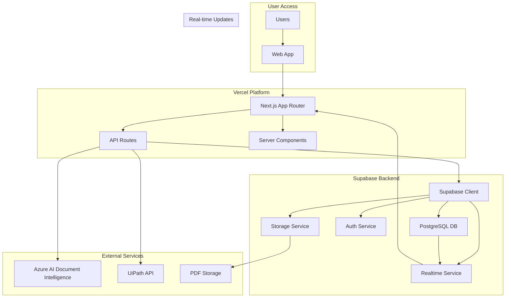
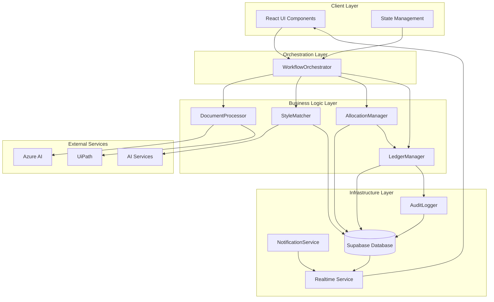
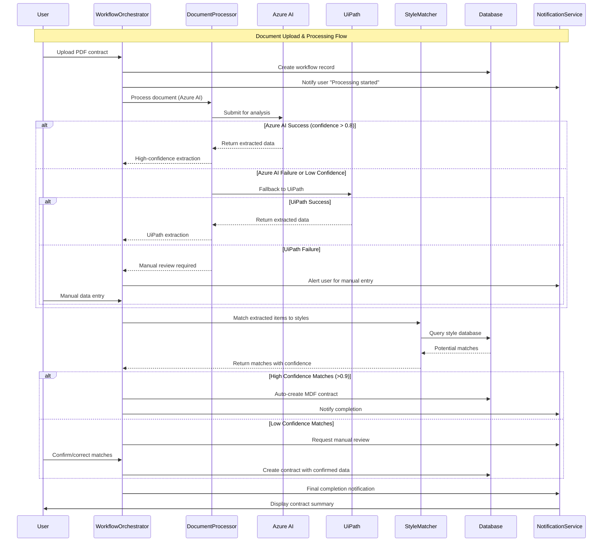
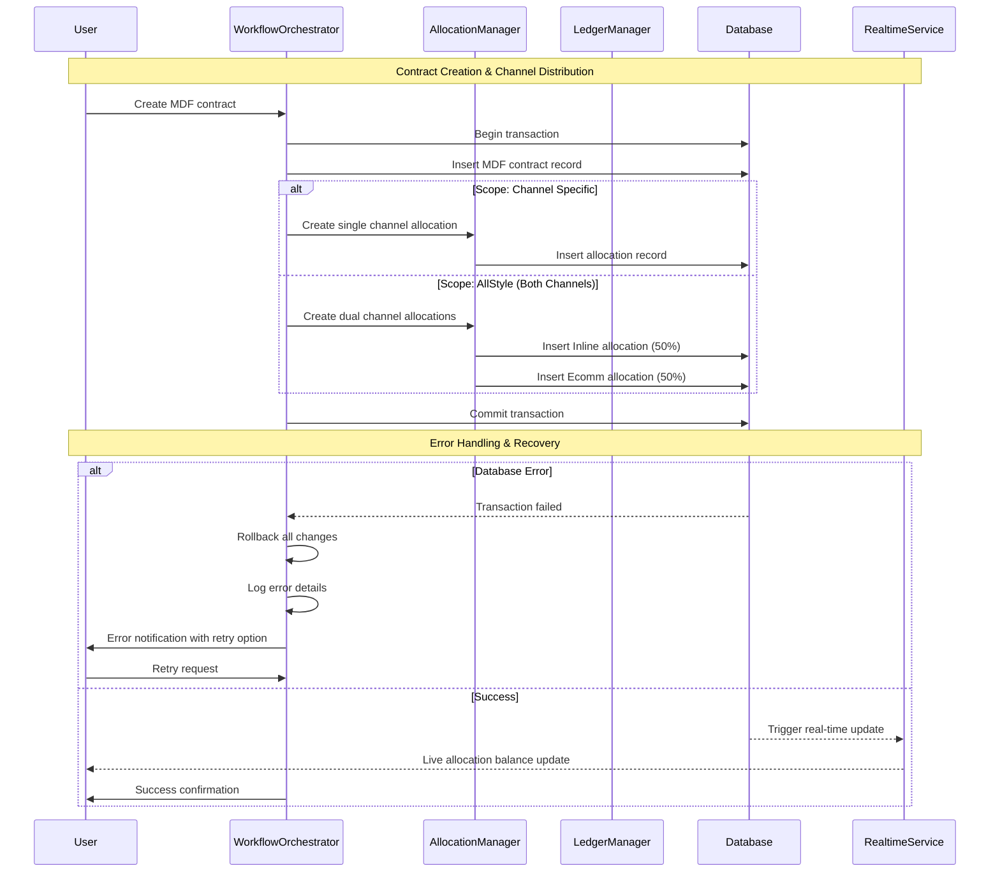
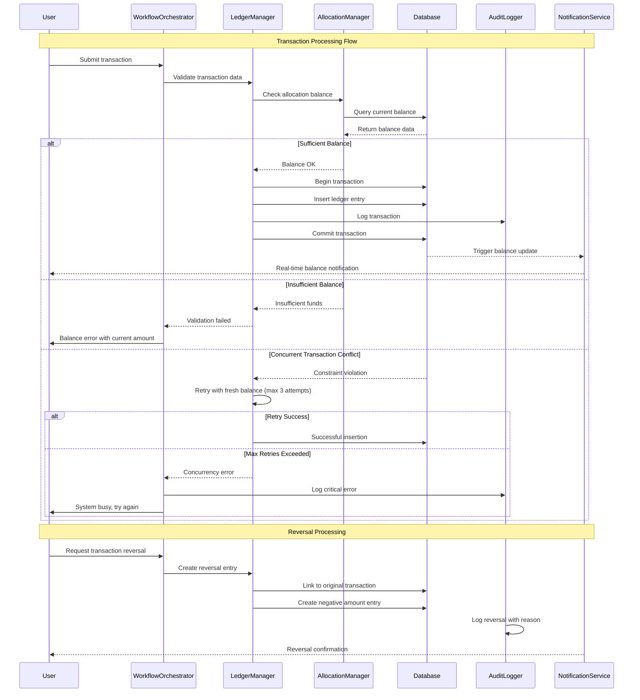
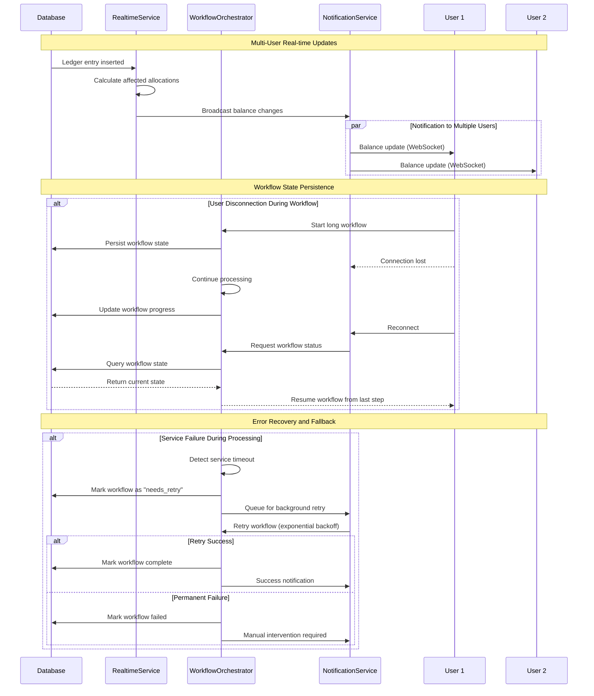
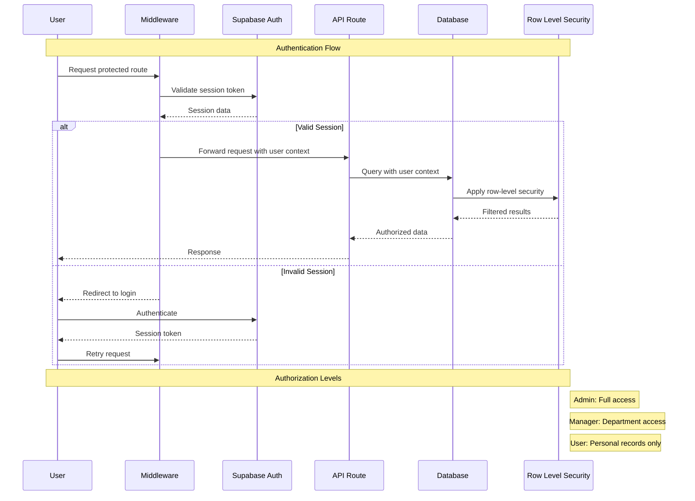

# MDF Contract Management System Fullstack Architecture Document

## Introduction

This document outlines the complete fullstack architecture for MDF Contract Management System, including backend systems, frontend implementation, and their integration. It serves as the single source of truth for AI-driven development, ensuring consistency across the entire technology stack.

This unified approach combines what would traditionally be separate backend and frontend architecture documents, streamlining the development process for modern fullstack applications where these concerns are increasingly intertwined.

### Starter Template or Existing Project

This is a greenfield project with a specific tech stack already determined: Next.js, Supabase, and Vercel deployment as specified in the PRD requirements.

### Change Log

| Date | Version | Description | Author |
|------|---------|-------------|---------|
| 2025-08-30 | 1.0 | Initial architecture document | Claude |

## High Level Architecture

### Technical Summary

The MDF Contract Management System follows a modern fullstack architecture using Next.js with App Router for both frontend and backend functionality, deployed on Vercel with Supabase as the managed backend service. The system integrates progressive OCR capabilities (PDF.js → Azure AI → UiPath) with AI-powered Style matching to automate the contract processing workflow from 3-5 days to 1-2 days. The architecture emphasizes real-time synchronization through Supabase's WebSocket capabilities, append-only ledger integrity for financial data, and a hybrid API approach using tRPC for internal type-safe operations and REST endpoints for external integrations.

### Platform and Infrastructure Choice

**Platform:** Vercel + Supabase + Azure AI Services
**Key Services:** Next.js hosting, Supabase PostgreSQL + Auth + Storage + Realtime, Azure AI Document Intelligence
**Deployment Host and Regions:** Vercel Edge Network (global), Supabase US-East, Azure AI Services multi-region

### Repository Structure

**Structure:** Monorepo
**Monorepo Tool:** Turborepo (Vercel-optimized for Next.js)
**Package Organization:** Apps (web app) + Packages (shared types, UI components, utilities)

### High Level Architecture Diagram



### Architectural Patterns

- **Jamstack Architecture:** Server-side rendering with API routes for dynamic functionality - _Rationale:_ Optimal performance through edge deployment while maintaining full-stack capabilities
- **Component-Based UI:** Reusable React Server/Client components with TypeScript - _Rationale:_ Maintainability and type safety with modern React patterns
- **Append-Only Ledger Pattern:** Immutable financial transaction records with audit trail - _Rationale:_ Financial integrity and compliance requirements for MDF contract management
- **Progressive Enhancement Pattern:** Fallback OCR chain (PDF.js → Azure AI → UiPath) - _Rationale:_ Reliability through graceful degradation when primary OCR services fail
- **Hybrid API Pattern:** tRPC for internal operations, REST for external integrations - _Rationale:_ Type safety for internal development, universal compatibility for external systems

## Tech Stack

| Category | Technology | Version | Purpose | Rationale |
|----------|------------|---------|---------|-----------|
| Frontend Language | TypeScript | 5.x | Type-safe development | Prevents runtime errors, improves code quality |
| Frontend Framework | Next.js | 14.x | Full-stack React framework | App Router, Server Components, integrated API routes |
| UI Component Library | Radix UI + Tailwind CSS | Latest | Accessible component primitives | Unstyled, accessible components with utility-first styling |
| State Management | Zustand + React Query | Latest | Client/server state management | Lightweight state management with server state caching |
| Backend Language | TypeScript | 5.x | Unified language stack | Single language across frontend/backend |
| Backend Framework | Next.js API Routes | 14.x | Serverless API endpoints | Integrated with frontend, automatic deployment |
| API Style | Hybrid (tRPC + REST) | Latest | Type-safe internal, universal external | tRPC for internal APIs, REST for external integrations |
| Database | Supabase PostgreSQL | Latest | Managed PostgreSQL with realtime | Real-time subscriptions, built-in auth, edge functions |
| Cache | Vercel Edge Cache | Latest | Global content delivery | Automatic edge caching for static/dynamic content |
| File Storage | Supabase Storage | Latest | PDF document storage | Integrated with database, secure file handling |
| Authentication | Supabase Auth | Latest | Managed authentication service | Built-in providers, JWT tokens, RLS policies |
| Frontend Testing | Vitest + Testing Library | Latest | Fast unit testing | Vite-powered testing with React components |
| Backend Testing | Vitest + Supertest | Latest | API endpoint testing | Same testing framework for consistency |
| E2E Testing | Playwright | Latest | End-to-end testing | Cross-browser testing, visual regression |
| Build Tool | Next.js Build | 14.x | Integrated build system | Optimized builds, automatic code splitting |
| Bundler | Turbopack | Latest | Fast bundler | Next.js integrated, faster than Webpack |
| IaC Tool | Vercel CLI + Supabase CLI | Latest | Deployment automation | Platform-specific deployment tools |
| CI/CD | GitHub Actions | Latest | Automated workflows | Vercel integration, preview deployments |
| Monitoring | Vercel Analytics + Sentry | Latest | Performance and error tracking | Real-time metrics and error monitoring |
| Logging | Vercel Logs + Supabase Logs | Latest | Centralized logging | Integrated platform logging |
| CSS Framework | Tailwind CSS | 3.x | Utility-first styling | Rapid UI development, consistent design system |

## Data Models

### Style
**Purpose:** Central entity representing a product style with associated item details and financial projections.

**Key Attributes:**
- style_number: string (Primary Key) - Unique identifier for the style
- item_number: string - Specific item code within the style
- item_desc: string - Description of the item
- season: string - Product season (Spring, Fall, etc.)
- business_line: string - Product category or line
- gender: string - Target gender demographic
- country: string - Country/region for the style

#### TypeScript Interface
```typescript
interface Style {
  style_number: string;
  item_number: string;
  item_desc: string;
  season: string;
  business_line: string;
  gender: string;
  country: string;
  created_at: string;
  updated_at: string;
}
```

#### Relationships
- One-to-many with OCSContract (style projections per channel)
- One-to-many with MDFContract (marketing fund contracts)

### MDFContract
**Purpose:** Marketing Development Fund contracts that provide budget allocations for promotional activities.

**Key Attributes:**
- mdf_id: bigint (Primary Key) - Unique contract identifier
- style_number: string (Foreign Key) - References Style.style_number
- scope: 'Channel' | 'AllStyle' - Contract scope type
- customer: string - Customer/retailer name
- contract_number: string - External contract reference
- signed_date: Date - Contract signature date
- funding_type_default: string - Default classification for transactions
- total_committed_amount: number - Total contract value
- effective_start: Date - Contract start date
- effective_end: Date - Contract end date

#### TypeScript Interface
```typescript
interface MDFContract {
  mdf_id: bigint;
  style_number: string;
  scope: 'Channel' | 'AllStyle';
  customer?: string;
  contract_number?: string;
  signed_date?: Date;
  funding_type_default?: string;
  total_committed_amount?: number;
  effective_start?: Date;
  effective_end?: Date;
  notes?: string;
  created_at: string;
  updated_at: string;
}
```

#### Relationships
- Many-to-one with Style
- One-to-many with Allocation (budget allocations per channel)

### Allocation
**Purpose:** Budget allocations from MDF contracts distributed across sales channels with real-time balance tracking.

**Key Attributes:**
- allocation_id: bigint (Primary Key) - Unique allocation identifier
- mdf_id: bigint (Foreign Key) - References MDFContract.mdf_id
- channel_code: 'Inline' | 'Ecomm' - Sales channel designation
- campaign_id: bigint (Foreign Key) - Optional campaign association
- allocated_amount: number - Budget amount allocated
- status: string - Allocation status

#### TypeScript Interface
```typescript
interface Allocation {
  allocation_id: bigint;
  mdf_id: bigint;
  channel_code: 'Inline' | 'Ecomm';
  campaign_id?: bigint;
  allocated_amount: number;
  status: string;
  notes?: string;
  created_at: string;
  updated_at: string;
}
```

#### Relationships
- Many-to-one with MDFContract
- One-to-many with LedgerEntry (transaction records)
- Many-to-one with Campaign (optional)

### OCSContract
**Purpose:** Operational sales projections per style and channel for planning and comparison against actual performance.

**Key Attributes:**
- ocs_id: bigint (Primary Key) - Unique OCS projection identifier
- style_number: string (Foreign Key) - References Style.style_number
- channel_code: 'Inline' | 'Ecomm' - Channel for projections
- ocs_units_proj: number - Projected unit sales
- ocs_funding_proj: number - Projected OCS funding needed
- print_fees_proj: number - Projected print fees
- above_beyond_proj: number - Projected above & beyond costs
- markdown_proj: number - Projected markdown costs

#### TypeScript Interface
```typescript
interface OCSContract {
  ocs_id: bigint;
  style_number: string;
  channel_code: 'Inline' | 'Ecomm';
  ocs_units_proj?: number;
  ocs_funding_proj?: number;
  print_fees_proj?: number;
  above_beyond_proj?: number;
  markdown_proj?: number;
  effective_start?: Date;
  effective_end?: Date;
  created_at: string;
  updated_at: string;
}
```

#### Relationships
- Many-to-one with Style
- One-to-many with LedgerEntry (actual vs projected tracking)

### LedgerEntry
**Purpose:** Append-only transaction ledger maintaining financial integrity with comprehensive reversal support.

**Key Attributes:**
- entry_id: bigint (Primary Key) - Unique transaction identifier
- allocation_id: bigint (Foreign Key) - Budget allocation being affected
- ocs_id: bigint (Foreign Key) - Associated OCS projection
- invoice_id: bigint (Foreign Key) - Related invoice record
- entry_date: Date - Transaction date
- funding_type: string - Classification of the transaction
- amount: number - Transaction amount (negative = spend, positive = credit)
- is_reversal: boolean - Indicates if this is a reversal transaction
- reverses_entry_id: bigint (Foreign Key) - Links to original entry being reversed

#### TypeScript Interface
```typescript
interface LedgerEntry {
  entry_id: bigint;
  allocation_id?: bigint;
  ocs_id?: bigint;
  invoice_id?: bigint;
  entry_date: Date;
  funding_type: string;
  amount: number;
  is_reversal: boolean;
  reverses_entry_id?: bigint;
  comments?: string;
  created_by?: string;
  created_at: string;
}
```

#### Relationships
- Many-to-one with Allocation
- Many-to-one with OCSContract
- Many-to-one with Invoice
- Self-referencing for reversals

### Invoice
**Purpose:** Invoice records for tracking external billing and linking to ledger transactions.

**Key Attributes:**
- invoice_id: bigint (Primary Key) - Unique invoice identifier
- invoice_number: string - External invoice reference
- invoice_date: Date - Invoice date
- customer: string - Customer/vendor name
- comments: string - Additional invoice notes

#### TypeScript Interface
```typescript
interface Invoice {
  invoice_id: bigint;
  invoice_number: string;
  invoice_date: Date;
  customer?: string;
  comments?: string;
  created_at: string;
}
```

#### Relationships
- One-to-many with LedgerEntry

### Campaign
**Purpose:** Optional grouping mechanism for organizing promotional activities and budget allocations by time periods.

**Key Attributes:**
- campaign_id: bigint (Primary Key) - Unique campaign identifier
- name: string - Campaign name/title
- start_date: Date - Campaign start date
- end_date: Date - Campaign end date
- notes: string - Campaign description and notes

#### TypeScript Interface
```typescript
interface Campaign {
  campaign_id: bigint;
  name: string;
  start_date?: Date;
  end_date?: Date;
  notes?: string;
}
```

#### Relationships
- One-to-many with Allocation

## API Specification

The system uses a hybrid API approach combining tRPC for internal type-safe operations and REST endpoints for external integrations.

### tRPC Internal APIs

```typescript
// Internal API router definitions for type-safe client-server communication
export const appRouter = router({
  style: styleRouter,
  mdf: mdfRouter,
  allocation: allocationRouter,
  ocs: ocsRouter,
  ledger: ledgerRouter,
  workflow: workflowRouter,
});

const styleRouter = router({
  getByNumber: publicProcedure
    .input(z.object({ style_number: z.string() }))
    .query(async ({ input }) => {
      // Returns Style with related data
    }),
  
  search: publicProcedure
    .input(z.object({ 
      query: z.string(),
      filters: z.object({
        season: z.string().optional(),
        business_line: z.string().optional()
      }).optional()
    }))
    .query(async ({ input }) => {
      // AI-powered style matching with confidence scores
    }),
    
  create: protectedProcedure
    .input(styleSchema)
    .mutation(async ({ input }) => {
      // Creates new style record
    })
});

const mdfRouter = router({
  create: protectedProcedure
    .input(mdfContractSchema)
    .mutation(async ({ input }) => {
      // Creates MDF contract with channel allocations
    }),
    
  getWithAllocations: publicProcedure
    .input(z.object({ mdf_id: z.number() }))
    .query(async ({ input }) => {
      // Returns MDF with allocation details and balances
    })
});

const allocationRouter = router({
  getBalance: publicProcedure
    .input(z.object({ allocation_id: z.number() }))
    .query(async ({ input }) => {
      // Real-time balance calculation with transaction history
    }),
    
  updateAmount: protectedProcedure
    .input(z.object({ 
      allocation_id: z.number(),
      new_amount: z.number(),
      reason: z.string()
    }))
    .mutation(async ({ input }) => {
      // Updates allocation with audit trail
    })
});

const ledgerRouter = router({
  addEntry: protectedProcedure
    .input(ledgerEntrySchema)
    .mutation(async ({ input }) => {
      // Adds transaction with balance validation
    }),
    
  reverseEntry: protectedProcedure
    .input(z.object({ 
      entry_id: z.number(),
      reason: z.string()
    }))
    .mutation(async ({ input }) => {
      // Creates linked reversal transaction
    }),
    
  getHistory: publicProcedure
    .input(z.object({ 
      allocation_id: z.number().optional(),
      ocs_id: z.number().optional(),
      date_range: z.object({
        start: z.date(),
        end: z.date()
      }).optional()
    }))
    .query(async ({ input }) => {
      // Returns filtered transaction history
    })
});

const workflowRouter = router({
  processDocument: protectedProcedure
    .input(z.object({ 
      file_url: z.string(),
      processing_options: z.object({
        ocr_provider: z.enum(['pdf-js', 'azure-ai', 'uipath']).optional(),
        auto_match_styles: z.boolean().optional()
      }).optional()
    }))
    .mutation(async ({ input }) => {
      // Orchestrates document processing workflow
    }),
    
  getWorkflowStatus: publicProcedure
    .input(z.object({ workflow_id: z.string() }))
    .query(async ({ input }) => {
      // Returns workflow progress and status
    })
});
```

### REST External APIs

```yaml
openapi: 3.0.0
info:
  title: MDF Contract Management External API
  version: 1.0.0
  description: REST endpoints for external system integrations
servers:
  - url: https://your-app.vercel.app/api/v1
    description: Production API

paths:
  /webhooks/document-processed:
    post:
      summary: UiPath document processing completion webhook
      requestBody:
        required: true
        content:
          application/json:
            schema:
              type: object
              properties:
                workflow_id:
                  type: string
                status:
                  type: string
                  enum: [completed, failed]
                extracted_data:
                  type: object
                confidence_score:
                  type: number
                  minimum: 0
                  maximum: 1
      responses:
        '200':
          description: Webhook processed successfully
          
  /integrations/erp/sync:
    post:
      summary: ERP system data synchronization
      security:
        - ApiKeyAuth: []
      requestBody:
        required: true
        content:
          application/json:
            schema:
              type: object
              properties:
                sync_type:
                  type: string
                  enum: [styles, contracts, transactions]
                data_payload:
                  type: array
                  items: {}
      responses:
        '200':
          description: Sync completed successfully
        '422':
          description: Validation errors
          content:
            application/json:
              schema:
                type: object
                properties:
                  errors:
                    type: array
                    items:
                      type: object
                      properties:
                        field: {type: string}
                        message: {type: string}
                        
components:
  securitySchemes:
    ApiKeyAuth:
      type: apiKey
      in: header
      name: X-API-Key
```

## Components

### WorkflowOrchestrator
**Responsibility:** Central coordination of complex multi-step business processes including document processing, AI style matching, and transaction workflows.

**Key Interfaces:**
- processDocument(fileUrl, options) -> WorkflowResult
- getWorkflowStatus(workflowId) -> WorkflowStatus
- handleWorkflowFailure(workflowId, errorData) -> RecoveryResult

**Dependencies:** DocumentProcessor, StyleMatcher, LedgerManager, NotificationService

**Technology Stack:** Next.js API routes, Supabase database for workflow state, Redis for job queues

### DocumentProcessor
**Responsibility:** Progressive OCR processing chain with fallback mechanisms for extracting structured data from MDF contract PDFs.

**Key Interfaces:**
- extractData(document, provider) -> ExtractionResult
- validateExtraction(data) -> ValidationResult
- enhanceExtraction(data) -> EnhancedData

**Dependencies:** Azure AI Document Intelligence, UiPath API, PDF.js library

**Technology Stack:** Next.js API routes, Azure AI SDK, UiPath REST client, Browser PDF.js

### StyleMatcher
**Responsibility:** AI-powered matching of extracted item data against existing style database with confidence scoring and manual review workflow.

**Key Interfaces:**
- findMatches(itemData) -> MatchResult[]
- validateMatch(styleNumber, itemData) -> ValidationResult
- trainMatcher(confirmedMatches) -> TrainingResult

**Dependencies:** Style database, AI/ML service, User interface for manual review

**Technology Stack:** Supabase database queries, OpenAI API for semantic matching, React components for review UI

### LedgerManager
**Responsibility:** Financial transaction management with append-only integrity, balance calculations, and comprehensive reversal support.

**Key Interfaces:**
- addEntry(transaction) -> LedgerResult
- reverseEntry(entryId, reason) -> ReversalResult
- calculateBalance(allocationId) -> BalanceResult
- validateTransaction(transaction) -> ValidationResult

**Dependencies:** Supabase database, Allocation service, Audit logger

**Technology Stack:** Supabase database with RLS policies, PostgreSQL triggers, TypeScript validation

### AllocationManager
**Responsibility:** MDF budget allocation management across channels with real-time balance tracking and automated channel distribution.

**Key Interfaces:**
- createAllocation(mdfId, channelDistribution) -> AllocationResult
- updateAllocation(allocationId, changes) -> UpdateResult
- getBalance(allocationId) -> BalanceData
- distributeToChannels(mdfContract) -> DistributionResult

**Dependencies:** MDFContract data, LedgerManager, Real-time notification service

**Technology Stack:** Supabase real-time subscriptions, PostgreSQL views for balance calculation, React Query for client state

### NotificationService
**Responsibility:** Real-time user notifications for workflow updates, balance changes, and system alerts using WebSocket connections.

**Key Interfaces:**
- sendNotification(userId, notification) -> void
- subscribeToUpdates(userId, filters) -> Subscription
- broadcastSystemAlert(message) -> void

**Dependencies:** Supabase Realtime, User management system

**Technology Stack:** Supabase Realtime WebSockets, React hooks for client subscriptions, Push notifications

### AuditLogger
**Responsibility:** Comprehensive audit trail for all system changes including user actions, automated processes, and data modifications.

**Key Interfaces:**
- logAction(action, user, data) -> void
- getAuditTrail(entityId, dateRange) -> AuditRecord[]
- generateComplianceReport(criteria) -> ComplianceReport

**Dependencies:** Supabase database, User authentication system

**Technology Stack:** Supabase database with audit table, PostgreSQL row-level security, Automated triggers

### Component Diagrams



## External APIs

### Azure AI Document Intelligence API
- **Purpose:** Primary OCR service for extracting structured data from MDF contract PDFs
- **Documentation:** https://docs.microsoft.com/en-us/azure/applied-ai-services/form-recognizer/
- **Base URL(s):** https://{region}.api.cognitive.microsoft.com/formrecognizer/v3.0
- **Authentication:** API Key in request headers
- **Rate Limits:** 15 requests/second for S0 tier

**Key Endpoints Used:**
- `POST /documentModels/{modelId}:analyze` - Analyze document with custom or prebuilt model
- `GET /documentModels/{modelId}/analyzeResults/{resultId}` - Get analysis results

**Integration Notes:** Primary OCR service with custom model training for MDF contract formats. Fallback to UiPath on failure or low confidence scores.

### UiPath Document Understanding API
- **Purpose:** Secondary OCR service for complex document processing when Azure AI fails or returns low confidence
- **Documentation:** https://docs.uipath.com/document-understanding/automation-cloud/latest/
- **Base URL(s):** https://cloud.uipath.com/api/documentunderstanding/v1
- **Authentication:** OAuth 2.0 Bearer token
- **Rate Limits:** Based on UiPath Cloud subscription tier

**Key Endpoints Used:**
- `POST /documents/analyze` - Submit document for processing
- `GET /documents/{documentId}/status` - Check processing status
- `GET /documents/{documentId}/results` - Retrieve extraction results

**Integration Notes:** Used as fallback OCR when Azure AI confidence is below threshold. Implements webhook callback for async processing completion.

### OpenAI GPT-4 API
- **Purpose:** AI-powered style matching and data enhancement for extracted contract information
- **Documentation:** https://platform.openai.com/docs/api-reference
- **Base URL(s):** https://api.openai.com/v1
- **Authentication:** Bearer token
- **Rate Limits:** 500 requests/minute for GPT-4

**Key Endpoints Used:**
- `POST /chat/completions` - Generate style matches and data enhancement suggestions
- `POST /embeddings` - Create embeddings for semantic style matching

**Integration Notes:** Used for intelligent style matching when exact matches aren't found. Generates confidence scores and alternative suggestions for manual review.

## Core Workflows

The system implements sophisticated workflow orchestration with comprehensive error handling, state persistence, and automatic fallback mechanisms to ensure reliable operation in production environments.

### Document Processing Workflow



### MDF Contract Creation and Channel Allocation



### Transaction Processing with Balance Validation



### Real-time Balance Updates and Notifications



## Database Schema

Based on the corrected data models and the existing DDL analysis, the database schema implements the Style-centric approach with comprehensive financial integrity controls.

```sql
-- =====================================================================
-- MDF Contract Management System - PostgreSQL Schema
-- Designed for Supabase deployment with RLS policies
-- =====================================================================

-- Core Types
CREATE TYPE channel AS ENUM ('Inline','Ecomm');
CREATE TYPE scope_type AS ENUM ('Channel','AllStyle');
CREATE TYPE funding_type AS ENUM (
  'OCS Funding',
  'Print Fees', 
  'Above & Beyond',
  'Markdown',
  'Adjustment',
  'Reversal'
);

-- =====================================================================
-- Core Entities
-- =====================================================================

-- Styles (Primary Product Entity)
CREATE TABLE "Style" (
  style_number   TEXT PRIMARY KEY,        -- String-based primary key
  item_number    TEXT NOT NULL,           -- Item code within style
  item_desc      TEXT,                    -- Item description
  season         TEXT,                    -- Product season
  business_line  TEXT,                    -- Product category
  gender         TEXT,                    -- Target demographic
  country        TEXT,                    -- Country/region
  created_at     TIMESTAMPTZ NOT NULL DEFAULT now(),
  updated_at     TIMESTAMPTZ NOT NULL DEFAULT now()
);

-- Campaigns (Optional grouping)
CREATE TABLE "Campaign" (
  campaign_id BIGSERIAL PRIMARY KEY,
  name        TEXT NOT NULL,
  start_date  DATE,
  end_date    DATE,
  notes       TEXT
);

-- =====================================================================
-- Contracts and Projections  
-- =====================================================================

-- MDF Contracts (Marketing Fund Agreements)
CREATE TABLE "MDFContract" (
  mdf_id                 BIGSERIAL PRIMARY KEY,
  style_number           TEXT NOT NULL REFERENCES "Style"(style_number),
  scope                  scope_type NOT NULL,
  customer               TEXT,
  contract_number        TEXT,
  signed_date            DATE,
  funding_type_default   funding_type,
  total_committed_amount NUMERIC(14,2),
  effective_start        DATE,
  effective_end          DATE,
  notes                  TEXT,
  created_at             TIMESTAMPTZ NOT NULL DEFAULT now(),
  updated_at             TIMESTAMPTZ NOT NULL DEFAULT now()
);

-- OCS Contracts (Operational Sales Projections)
CREATE TABLE "OCSContract" (
  ocs_id             BIGSERIAL PRIMARY KEY,
  style_number       TEXT NOT NULL REFERENCES "Style"(style_number),
  channel_code       channel NOT NULL,
  
  -- Financial Projections
  ocs_units_proj     NUMERIC(14,2),
  ocs_funding_proj   NUMERIC(14,2),        -- Added per user correction
  print_fees_proj    NUMERIC(14,2),
  above_beyond_proj  NUMERIC(14,2),
  markdown_proj      NUMERIC(14,2),
  
  effective_start    DATE,
  effective_end      DATE,
  created_at         TIMESTAMPTZ NOT NULL DEFAULT now(),
  updated_at         TIMESTAMPTZ NOT NULL DEFAULT now()
);

-- Budget Allocations (Channel-specific allocations from MDF contracts)
CREATE TABLE "Allocation" (
  allocation_id    BIGSERIAL PRIMARY KEY,
  mdf_id           BIGINT NOT NULL REFERENCES "MDFContract"(mdf_id),
  channel_code     channel NOT NULL,
  campaign_id      BIGINT REFERENCES "Campaign"(campaign_id),
  allocated_amount NUMERIC(14,2) NOT NULL CHECK (allocated_amount >= 0),
  status           TEXT DEFAULT 'Active',
  notes            TEXT,
  created_at       TIMESTAMPTZ NOT NULL DEFAULT now(),
  updated_at       TIMESTAMPTZ NOT NULL DEFAULT now(),
  
  -- Ensure one allocation per channel per MDF contract
  UNIQUE(mdf_id, channel_code)
);

-- Invoices (External billing records)
CREATE TABLE "Invoice" (
  invoice_id     BIGSERIAL PRIMARY KEY,
  invoice_number TEXT UNIQUE NOT NULL,
  invoice_date   DATE NOT NULL,
  customer       TEXT,
  comments       TEXT,
  created_at     TIMESTAMPTZ NOT NULL DEFAULT now()
);

-- =====================================================================
-- Financial Ledger (Append-only transaction log)
-- =====================================================================

CREATE TABLE "LedgerEntry" (
  entry_id          BIGSERIAL PRIMARY KEY,
  
  -- Foreign Key References
  allocation_id     BIGINT REFERENCES "Allocation"(allocation_id),
  ocs_id            BIGINT REFERENCES "OCSContract"(ocs_id),
  invoice_id        BIGINT REFERENCES "Invoice"(invoice_id),
  
  -- Transaction Details
  entry_date        DATE NOT NULL DEFAULT CURRENT_DATE,
  funding_type      funding_type NOT NULL,
  amount            NUMERIC(14,2) NOT NULL CHECK (amount <> 0),  -- No zero amounts
  
  -- Reversal Support
  is_reversal       BOOLEAN NOT NULL DEFAULT FALSE,
  reverses_entry_id BIGINT REFERENCES "LedgerEntry"(entry_id),
  
  -- Audit Fields
  comments          TEXT,
  created_by        TEXT,
  created_at        TIMESTAMPTZ NOT NULL DEFAULT now()
);

-- Manual Adjustments (Top-level corrections)
CREATE TABLE "Adjustment" (
  adjustment_id BIGSERIAL PRIMARY KEY,
  target_type   TEXT NOT NULL CHECK (target_type IN ('OCS','Allocation')),
  target_id     BIGINT NOT NULL,
  reason        TEXT,
  amount        NUMERIC(14,2) NOT NULL,
  approved_by   TEXT,
  approved_at   TIMESTAMPTZ,
  created_at    TIMESTAMPTZ NOT NULL DEFAULT now()
);

-- =====================================================================
-- Indexes for Performance
-- =====================================================================

CREATE INDEX idx_style_season_biz ON "Style"(season, business_line);
CREATE INDEX idx_style_item ON "Style"(item_number);

CREATE INDEX idx_mdf_style ON "MDFContract"(style_number);
CREATE INDEX idx_mdf_dates ON "MDFContract"(effective_start, effective_end);

CREATE INDEX idx_ocs_style_channel ON "OCSContract"(style_number, channel_code);
CREATE INDEX idx_ocs_dates ON "OCSContract"(effective_start, effective_end);

CREATE INDEX idx_alloc_mdf_channel ON "Allocation"(mdf_id, channel_code);
CREATE INDEX idx_alloc_campaign ON "Allocation"(campaign_id);

CREATE INDEX idx_ledger_allocation ON "LedgerEntry"(allocation_id);
CREATE INDEX idx_ledger_ocs ON "LedgerEntry"(ocs_id);
CREATE INDEX idx_ledger_date ON "LedgerEntry"(entry_date);
CREATE INDEX idx_ledger_reversal ON "LedgerEntry"(reverses_entry_id);

CREATE INDEX idx_invoice_date ON "Invoice"(invoice_date);
CREATE INDEX idx_invoice_customer ON "Invoice"(customer);

-- =====================================================================
-- Business Logic Constraints and Triggers
-- =====================================================================

-- Linked Reversal Validation Trigger
CREATE OR REPLACE FUNCTION enforce_linked_reversal() RETURNS trigger AS $$
DECLARE
  _orig_amt NUMERIC(14,2);
BEGIN
  IF NEW.reverses_entry_id IS NOT NULL THEN
    SELECT amount INTO _orig_amt
    FROM "LedgerEntry"
    WHERE entry_id = NEW.reverses_entry_id
    FOR UPDATE;

    IF _orig_amt IS NULL THEN
      RAISE EXCEPTION 'reverses_entry_id % not found', NEW.reverses_entry_id;
    END IF;

    -- Linked reversals must be exact negative of original
    IF NEW.amount <> -_orig_amt THEN
      RAISE EXCEPTION 'Linked reversal must negate original (expected % but got %)', 
        -_orig_amt, NEW.amount;
    END IF;

    -- Auto-set reversal flags
    NEW.is_reversal := TRUE;
    NEW.funding_type := 'Reversal';
  END IF;

  RETURN NEW;
END;
$$ LANGUAGE plpgsql;

CREATE TRIGGER trg_enforce_linked_reversal
BEFORE INSERT OR UPDATE ON "LedgerEntry"
FOR EACH ROW
EXECUTE FUNCTION enforce_linked_reversal();

-- =====================================================================
-- Real-time Balance Views
-- =====================================================================

-- Allocation Balance (allocated, spent, remaining)
CREATE OR REPLACE VIEW v_allocation_balance AS
SELECT
  a.allocation_id,
  a.mdf_id,
  a.style_number,
  a.channel_code,
  a.allocated_amount,
  COALESCE(SUM(CASE WHEN l.amount < 0 THEN -l.amount ELSE 0 END), 0) AS total_spent,
  COALESCE(SUM(CASE WHEN l.amount > 0 THEN l.amount ELSE 0 END), 0) AS total_credits,
  a.allocated_amount + COALESCE(SUM(l.amount), 0) AS remaining_balance
FROM "Allocation" a
LEFT JOIN "LedgerEntry" l ON l.allocation_id = a.allocation_id
LEFT JOIN "MDFContract" m ON m.mdf_id = a.mdf_id
GROUP BY a.allocation_id, a.mdf_id, m.style_number, a.channel_code, a.allocated_amount;

-- OCS vs Actual Comparison
CREATE OR REPLACE VIEW v_ocs_vs_actual AS
SELECT
  o.ocs_id,
  o.style_number,
  o.channel_code,
  o.ocs_funding_proj,
  o.print_fees_proj,
  o.above_beyond_proj,
  o.markdown_proj,
  COALESCE(SUM(CASE WHEN l.funding_type = 'OCS Funding' THEN -l.amount ELSE 0 END), 0) AS actual_ocs_funding,
  COALESCE(SUM(CASE WHEN l.funding_type = 'Print Fees' THEN -l.amount ELSE 0 END), 0) AS actual_print_fees,
  COALESCE(SUM(CASE WHEN l.funding_type = 'Above & Beyond' THEN -l.amount ELSE 0 END), 0) AS actual_above_beyond,
  COALESCE(SUM(CASE WHEN l.funding_type = 'Markdown' THEN -l.amount ELSE 0 END), 0) AS actual_markdown
FROM "OCSContract" o
LEFT JOIN "LedgerEntry" l ON l.ocs_id = o.ocs_id
GROUP BY o.ocs_id, o.style_number, o.channel_code, 
         o.ocs_funding_proj, o.print_fees_proj, o.above_beyond_proj, o.markdown_proj;

-- Style Summary (aggregated across channels)
CREATE OR REPLACE VIEW v_style_summary AS
SELECT 
  s.style_number,
  s.item_number,
  s.item_desc,
  s.season,
  s.business_line,
  COUNT(DISTINCT m.mdf_id) as mdf_contract_count,
  COUNT(DISTINCT o.ocs_id) as ocs_projection_count,
  COALESCE(SUM(a.allocated_amount), 0) as total_allocated,
  COALESCE(SUM(CASE WHEN l.amount < 0 THEN -l.amount ELSE 0 END), 0) as total_spent
FROM "Style" s
LEFT JOIN "MDFContract" m ON m.style_number = s.style_number
LEFT JOIN "OCSContract" o ON o.style_number = s.style_number  
LEFT JOIN "Allocation" a ON a.mdf_id = m.mdf_id
LEFT JOIN "LedgerEntry" l ON l.allocation_id = a.allocation_id
GROUP BY s.style_number, s.item_number, s.item_desc, s.season, s.business_line;

-- =====================================================================
-- Row Level Security Policies (for Supabase)
-- =====================================================================

-- Enable RLS on all tables
ALTER TABLE "Style" ENABLE ROW LEVEL SECURITY;
ALTER TABLE "MDFContract" ENABLE ROW LEVEL SECURITY;  
ALTER TABLE "OCSContract" ENABLE ROW LEVEL SECURITY;
ALTER TABLE "Allocation" ENABLE ROW LEVEL SECURITY;
ALTER TABLE "LedgerEntry" ENABLE ROW LEVEL SECURITY;
ALTER TABLE "Invoice" ENABLE ROW LEVEL SECURITY;
ALTER TABLE "Campaign" ENABLE ROW LEVEL SECURITY;
ALTER TABLE "Adjustment" ENABLE ROW LEVEL SECURITY;

-- Basic read policy (authenticated users can read all data)
CREATE POLICY "Enable read access for authenticated users" ON "Style"
    FOR SELECT USING (auth.role() = 'authenticated');

CREATE POLICY "Enable read access for authenticated users" ON "MDFContract"
    FOR SELECT USING (auth.role() = 'authenticated');

CREATE POLICY "Enable read access for authenticated users" ON "OCSContract"
    FOR SELECT USING (auth.role() = 'authenticated');

CREATE POLICY "Enable read access for authenticated users" ON "Allocation"
    FOR SELECT USING (auth.role() = 'authenticated');

CREATE POLICY "Enable read access for authenticated users" ON "LedgerEntry"
    FOR SELECT USING (auth.role() = 'authenticated');

CREATE POLICY "Enable read access for authenticated users" ON "Invoice"
    FOR SELECT USING (auth.role() = 'authenticated');

CREATE POLICY "Enable read access for authenticated users" ON "Campaign"
    FOR SELECT USING (auth.role() = 'authenticated');

CREATE POLICY "Enable read access for authenticated users" ON "Adjustment"
    FOR SELECT USING (auth.role() = 'authenticated');

-- Insert/Update policies (authenticated users can modify)
CREATE POLICY "Enable insert for authenticated users" ON "Style"
    FOR INSERT WITH CHECK (auth.role() = 'authenticated');

CREATE POLICY "Enable update for authenticated users" ON "Style"
    FOR UPDATE USING (auth.role() = 'authenticated');

-- Similar policies would be created for all other tables...

-- =====================================================================
-- Sample Data Functions (Development/Testing)
-- =====================================================================

-- Function to create sample data
CREATE OR REPLACE FUNCTION create_sample_data() RETURNS void AS $$
BEGIN
  -- Sample Styles
  INSERT INTO "Style" (style_number, item_number, item_desc, season, business_line, gender, country)
  VALUES 
    ('ST001', 'ITM001', 'Summer Casual Shirt', 'Summer 2024', 'Casual Wear', 'Unisex', 'US'),
    ('ST002', 'ITM002', 'Winter Jacket', 'Winter 2024', 'Outerwear', 'Unisex', 'US'),
    ('ST003', 'ITM003', 'Spring Dress', 'Spring 2024', 'Formal', 'Women', 'US')
  ON CONFLICT (style_number) DO NOTHING;
  
  -- Sample MDF Contracts
  INSERT INTO "MDFContract" (style_number, scope, customer, contract_number, total_committed_amount, effective_start, effective_end)
  VALUES
    ('ST001', 'AllStyle', 'Major Retailer', 'MDF-2024-001', 50000.00, '2024-01-01', '2024-12-31'),
    ('ST002', 'Channel', 'Premium Store', 'MDF-2024-002', 25000.00, '2024-03-01', '2024-08-31')
  ON CONFLICT DO NOTHING;
  
RAISE NOTICE 'Sample data created successfully';
END;
$$ LANGUAGE plpgsql;
```

This schema provides:

**Financial Integrity:** Append-only ledger with comprehensive reversal support and balance validation triggers.

**Real-time Capabilities:** Views optimized for real-time balance calculations with Supabase subscriptions.

**Scalability:** Proper indexing strategy for performance at scale, with partitioning opportunities on date fields.

**Security:** Row-level security policies ready for Supabase auth integration with role-based access control.

**Flexibility:** Support for both Channel-specific and AllStyle MDF contracts with automatic channel allocation.

## Frontend Architecture

The frontend architecture leverages Next.js 14 with App Router, implementing a modern React architecture with Server Components, Client Components, and progressive enhancement patterns optimized for the MDF contract management workflow.

### Component Architecture

#### Component Organization
```
src/
├── app/                    # Next.js App Router
│   ├── (dashboard)/       # Route groups
│   │   ├── contracts/     # MDF contract pages
│   │   ├── allocations/   # Budget allocation pages
│   │   ├── ledger/        # Transaction ledger pages
│   │   └── analytics/     # Reporting and analytics
│   ├── api/              # API route handlers
│   ├── globals.css       # Global styles
│   ├── layout.tsx        # Root layout
│   └── page.tsx          # Home page
├── components/            # Reusable UI components
│   ├── ui/               # Base UI primitives (Radix + Tailwind)
│   ├── forms/            # Form components with validation
│   ├── charts/           # Data visualization components
│   ├── tables/           # Data table components
│   └── modals/           # Modal dialog components
├── hooks/                # Custom React hooks
├── lib/                  # Utilities and configurations
└── types/                # TypeScript type definitions
```

#### Component Template
```typescript
'use client'

import { useState } from 'react'
import { useQuery } from '@tanstack/react-query'
import { trpc } from '@/lib/trpc'
import { Button } from '@/components/ui/button'
import { LoadingSpinner } from '@/components/ui/loading-spinner'
import { ErrorBoundary } from '@/components/ui/error-boundary'

interface AllocationManagerProps {
  mdfId: number
  onAllocationUpdate?: (allocation: Allocation) => void
}

export function AllocationManager({ mdfId, onAllocationUpdate }: AllocationManagerProps) {
  const [isEditing, setIsEditing] = useState(false)
  
  // Server state with real-time updates
  const { data: allocations, isLoading, error } = trpc.allocation.getByMdfId.useQuery(
    { mdf_id: mdfId },
    {
      refetchOnWindowFocus: false,
      staleTime: 30000, // 30 seconds
    }
  )
  
  if (isLoading) return <LoadingSpinner />
  if (error) throw error

  return (
    <ErrorBoundary>
      <div className="space-y-4">
        <div className="flex items-center justify-between">
          <h2 className="text-2xl font-semibold">Channel Allocations</h2>
          <Button 
            variant={isEditing ? "outline" : "default"}
            onClick={() => setIsEditing(!isEditing)}
          >
            {isEditing ? 'Cancel' : 'Edit Allocations'}
          </Button>
        </div>
        
        {allocations?.map((allocation) => (
          <AllocationCard 
            key={allocation.allocation_id}
            allocation={allocation}
            isEditing={isEditing}
            onUpdate={onAllocationUpdate}
          />
        ))}
      </div>
    </ErrorBoundary>
  )
}
```

### State Management Architecture

#### State Structure
```typescript
// Global application state using Zustand
interface AppState {
  // User session state
  user: User | null
  setUser: (user: User | null) => void
  
  // UI state
  sidebarOpen: boolean
  setSidebarOpen: (open: boolean) => void
  theme: 'light' | 'dark'
  setTheme: (theme: 'light' | 'dark') => void
  
  // Workflow state
  activeWorkflows: WorkflowStatus[]
  addWorkflow: (workflow: WorkflowStatus) => void
  updateWorkflow: (id: string, status: Partial<WorkflowStatus>) => void
  removeWorkflow: (id: string) => void
  
  // Real-time notifications
  notifications: Notification[]
  addNotification: (notification: Notification) => void
  removeNotification: (id: string) => void
}

// Create store
export const useAppStore = create<AppState>()((set) => ({
  user: null,
  setUser: (user) => set({ user }),
  
  sidebarOpen: true,
  setSidebarOpen: (sidebarOpen) => set({ sidebarOpen }),
  
  theme: 'light',
  setTheme: (theme) => set({ theme }),
  
  activeWorkflows: [],
  addWorkflow: (workflow) => set((state) => ({
    activeWorkflows: [...state.activeWorkflows, workflow]
  })),
  updateWorkflow: (id, updates) => set((state) => ({
    activeWorkflows: state.activeWorkflows.map(w => 
      w.id === id ? { ...w, ...updates } : w
    )
  })),
  removeWorkflow: (id) => set((state) => ({
    activeWorkflows: state.activeWorkflows.filter(w => w.id !== id)
  })),
  
  notifications: [],
  addNotification: (notification) => set((state) => ({
    notifications: [...state.notifications, notification]
  })),
  removeNotification: (id) => set((state) => ({
    notifications: state.notifications.filter(n => n.id !== id)
  }))
}))
```

#### State Management Patterns
- **Server State:** React Query for caching, synchronization, and optimistic updates
- **Client State:** Zustand for UI state, user preferences, and workflow tracking
- **Form State:** React Hook Form with Zod validation for type-safe form handling
- **Real-time State:** Supabase subscriptions integrated with React Query for live updates

### Routing Architecture

#### Route Organization
```
app/
├── (auth)/               # Authentication routes
│   ├── login/
│   └── register/
├── (dashboard)/          # Protected dashboard routes
│   ├── layout.tsx       # Dashboard layout with sidebar
│   ├── page.tsx         # Dashboard home
│   ├── contracts/       # MDF contract management
│   │   ├── page.tsx     # Contract list
│   │   ├── new/         # Create new contract
│   │   └── [id]/        # Individual contract details
│   ├── allocations/     # Budget allocation management
│   │   ├── page.tsx     # Allocation overview
│   │   └── [id]/        # Allocation details
│   ├── ledger/          # Transaction ledger
│   │   ├── page.tsx     # Transaction list
│   │   └── entry/       # New transaction entry
│   ├── analytics/       # Reporting and analytics
│   │   ├── page.tsx     # Analytics dashboard
│   │   ├── projections/ # OCS vs Actual reports
│   │   └── compliance/  # Audit and compliance reports
│   └── settings/        # User and system settings
└── api/                 # API route handlers
    ├── trpc/           # tRPC router endpoints
    ├── webhooks/       # External webhook handlers
    └── auth/           # Authentication endpoints
```

#### Protected Route Pattern
```typescript
// middleware.ts - Route protection at edge level
import { createMiddlewareClient } from '@supabase/auth-helpers-nextjs'
import { NextResponse } from 'next/server'
import type { NextRequest } from 'next/server'

export async function middleware(req: NextRequest) {
  const res = NextResponse.next()
  const supabase = createMiddlewareClient({ req, res })
  
  const {
    data: { session },
  } = await supabase.auth.getSession()

  // Protect dashboard routes
  if (req.nextUrl.pathname.startsWith('/(dashboard)')) {
    if (!session) {
      return NextResponse.redirect(new URL('/login', req.url))
    }
  }
  
  // Redirect authenticated users from auth pages
  if (req.nextUrl.pathname.startsWith('/(auth)')) {
    if (session) {
      return NextResponse.redirect(new URL('/', req.url))
    }
  }

  return res
}

export const config = {
  matcher: [
    '/((?!_next/static|_next/image|favicon.ico|.*\\.(?:svg|png|jpg|jpeg|gif|webp)$).*)',
  ],
}
```

### Frontend Services Layer

#### API Client Setup
```typescript
// lib/trpc.ts - tRPC client configuration
import { createTRPCReact } from '@trpc/react-query'
import { createTRPCMsw } from 'msw-trpc'
import { httpBatchLink } from '@trpc/client'
import { type AppRouter } from '@/server/api/root'

export const trpc = createTRPCReact<AppRouter>()

export function getBaseUrl() {
  if (typeof window !== 'undefined') return ''
  if (process.env.VERCEL_URL) return `https://${process.env.VERCEL_URL}`
  return `http://localhost:${process.env.PORT ?? 3000}`
}

export function getTRPCClient() {
  return trpc.createClient({
    links: [
      httpBatchLink({
        url: `${getBaseUrl()}/api/trpc`,
        headers() {
          return {
            authorization: `Bearer ${getAuthToken()}`,
          }
        },
      }),
    ],
  })
}

// Real-time subscription hook
export function useRealtimeSubscription<T>(
  table: string,
  filter?: string,
  callback?: (payload: T) => void
) {
  const supabase = useSupabaseClient()
  
  useEffect(() => {
    const channel = supabase
      .channel(`realtime:${table}`)
      .on(
        'postgres_changes',
        {
          event: '*',
          schema: 'public',
          table: table,
          filter: filter,
        },
        (payload) => {
          callback?.(payload.new as T)
          // Invalidate related queries
          trpc.useContext().allocation.getBalance.invalidate()
          trpc.useContext().ledger.getHistory.invalidate()
        }
      )
      .subscribe()

    return () => {
      supabase.removeChannel(channel)
    }
  }, [table, filter, callback, supabase])
}
```

#### Service Example
```typescript
// hooks/useAllocationBalance.ts - Real-time balance tracking
import { useQuery } from '@tanstack/react-query'
import { trpc } from '@/lib/trpc'
import { useRealtimeSubscription } from '@/lib/trpc'

export function useAllocationBalance(allocationId: number) {
  // Get initial balance data
  const balanceQuery = trpc.allocation.getBalance.useQuery(
    { allocation_id: allocationId },
    {
      staleTime: 60000, // 1 minute
      cacheTime: 300000, // 5 minutes
    }
  )
  
  // Subscribe to real-time updates
  useRealtimeSubscription(
    'LedgerEntry',
    `allocation_id=eq.${allocationId}`,
    (payload) => {
      // Optimistically update the cache
      trpc.useContext().allocation.getBalance.setData(
        { allocation_id: allocationId },
        (oldData) => {
          if (!oldData) return oldData
          
          // Recalculate balance based on new transaction
          const amountChange = payload.amount
          return {
            ...oldData,
            remaining_balance: oldData.remaining_balance + amountChange,
            total_spent: amountChange < 0 
              ? oldData.total_spent + Math.abs(amountChange)
              : oldData.total_spent,
            total_credits: amountChange > 0
              ? oldData.total_credits + amountChange  
              : oldData.total_credits
          }
        }
      )
    }
  )
  
  return {
    balance: balanceQuery.data,
    isLoading: balanceQuery.isLoading,
    error: balanceQuery.error,
    refetch: balanceQuery.refetch,
  }
}

// components/AllocationBalanceCard.tsx - Real-time balance display
export function AllocationBalanceCard({ allocationId }: { allocationId: number }) {
  const { balance, isLoading, error } = useAllocationBalance(allocationId)
  
  if (isLoading) return <BalanceSkeleton />
  if (error) return <BalanceError error={error} />
  if (!balance) return null
  
  const balanceColor = balance.remaining_balance < 0 
    ? 'text-red-600' 
    : balance.remaining_balance < balance.allocated_amount * 0.1
    ? 'text-yellow-600'
    : 'text-green-600'
  
  return (
    <Card className="p-4">
      <div className="grid grid-cols-2 gap-4">
        <div>
          <Label className="text-sm text-gray-600">Allocated</Label>
          <div className="text-2xl font-semibold">
            ${balance.allocated_amount.toLocaleString()}
          </div>
        </div>
        <div>
          <Label className="text-sm text-gray-600">Remaining</Label>
          <div className={`text-2xl font-semibold ${balanceColor}`}>
            ${balance.remaining_balance.toLocaleString()}
          </div>
        </div>
        <div>
          <Label className="text-sm text-gray-600">Total Spent</Label>
          <div className="text-lg">
            ${balance.total_spent.toLocaleString()}
          </div>
        </div>
        <div>
          <Label className="text-sm text-gray-600">Total Credits</Label>
          <div className="text-lg">
            ${balance.total_credits.toLocaleString()}
          </div>
        </div>
      </div>
      
      {/* Real-time activity indicator */}
      <div className="mt-4 flex items-center justify-between text-xs text-gray-500">
        <span>Updated in real-time</span>
        <div className="flex items-center gap-1">
          <div className="h-2 w-2 bg-green-500 rounded-full animate-pulse" />
          <span>Live</span>
        </div>
      </div>
    </Card>
  )
}
```

## Backend Architecture

The backend architecture leverages Next.js API Routes with serverless deployment on Vercel, implementing a service-oriented approach with clear separation of concerns for business logic, data access, and external integrations.

### Service Architecture

#### Function Organization
```
src/
├── app/
│   └── api/                   # Next.js API Routes
│       ├── trpc/              # tRPC router endpoints
│       │   └── [trpc]/        # Dynamic tRPC handler
│       ├── webhooks/          # External webhook handlers
│       │   ├── uipath/        # UiPath document processing
│       │   ├── azure-ai/      # Azure AI completion callbacks
│       │   └── supabase/      # Database change notifications
│       ├── cron/              # Scheduled background jobs
│       │   ├── sync-erp/      # ERP system synchronization
│       │   └── cleanup/       # Data cleanup and maintenance
│       └── auth/              # Authentication endpoints
├── lib/
│   ├── services/              # Business logic services
│   │   ├── workflow-orchestrator.ts
│   │   ├── document-processor.ts
│   │   ├── style-matcher.ts
│   │   ├── ledger-manager.ts
│   │   ├── allocation-manager.ts
│   │   └── notification-service.ts
│   ├── repositories/          # Data access layer
│   │   ├── base-repository.ts
│   │   ├── style-repository.ts
│   │   ├── mdf-repository.ts
│   │   ├── allocation-repository.ts
│   │   └── ledger-repository.ts
│   ├── integrations/          # External service clients
│   │   ├── azure-ai-client.ts
│   │   ├── uipath-client.ts
│   │   ├── openai-client.ts
│   │   └── supabase-client.ts
│   └── utils/                 # Shared utilities
│       ├── validation.ts
│       ├── error-handling.ts
│       ├── logging.ts
│       └── crypto.ts
```

#### Function Template
```typescript
// app/api/trpc/[trpc]/route.ts - tRPC API handler
import { fetchRequestHandler } from '@trpc/server/adapters/fetch'
import { appRouter } from '@/server/api/root'
import { createTRPCContext } from '@/server/api/context'
import { NextRequest } from 'next/server'

const handler = async (req: NextRequest) => {
  return fetchRequestHandler({
    endpoint: '/api/trpc',
    req,
    router: appRouter,
    createContext: () => createTRPCContext({ req }),
    onError:
      process.env.NODE_ENV === 'development'
        ? ({ path, error }) => {
            console.error(
              `❌ tRPC failed on ${path ?? '<no-path>'}: ${error.message}`,
            )
          }
        : undefined,
  })
}

export { handler as GET, handler as POST }

// server/api/context.ts - tRPC context with auth and database
import { createServerComponentClient } from '@supabase/auth-helpers-nextjs'
import { cookies } from 'next/headers'
import { NextRequest } from 'next/server'
import { supabase } from '@/lib/integrations/supabase-client'

export async function createTRPCContext({ req }: { req: NextRequest }) {
  // Create Supabase client with user session
  const supabaseClient = createServerComponentClient({ cookies })
  
  const {
    data: { session },
  } = await supabaseClient.auth.getSession()

  return {
    supabase: supabaseClient,
    session,
    user: session?.user ?? null,
    req,
  }
}

export type Context = Awaited<ReturnType<typeof createTRPCContext>>

// server/api/routers/allocation.ts - Allocation management router
import { z } from 'zod'
import { createTRPCRouter, publicProcedure, protectedProcedure } from '@/server/api/trpc'
import { AllocationManager } from '@/lib/services/allocation-manager'
import { LedgerManager } from '@/lib/services/ledger-manager'
import { TRPCError } from '@trpc/server'

export const allocationRouter = createTRPCRouter({
  getBalance: publicProcedure
    .input(z.object({ allocation_id: z.number() }))
    .query(async ({ input, ctx }) => {
      try {
        const allocationManager = new AllocationManager(ctx.supabase)
        return await allocationManager.getBalance(input.allocation_id)
      } catch (error) {
        throw new TRPCError({
          code: 'INTERNAL_SERVER_ERROR',
          message: 'Failed to retrieve allocation balance',
          cause: error,
        })
      }
    }),
    
  updateAmount: protectedProcedure
    .input(z.object({ 
      allocation_id: z.number(),
      new_amount: z.number().min(0),
      reason: z.string().min(1)
    }))
    .mutation(async ({ input, ctx }) => {
      try {
        const allocationManager = new AllocationManager(ctx.supabase)
        const ledgerManager = new LedgerManager(ctx.supabase)
        
        // Begin transaction
        const result = await allocationManager.updateAllocation({
          allocation_id: input.allocation_id,
          new_amount: input.new_amount,
          reason: input.reason,
          updated_by: ctx.user!.id,
        })
        
        // Log adjustment in ledger
        await ledgerManager.addAdjustmentEntry({
          target_type: 'Allocation',
          target_id: input.allocation_id,
          amount: input.new_amount - result.previous_amount,
          reason: input.reason,
          created_by: ctx.user!.id,
        })
        
        return result
      } catch (error) {
        throw new TRPCError({
          code: 'BAD_REQUEST',
          message: 'Failed to update allocation amount',
          cause: error,
        })
      }
    }),
    
  getByMdfId: publicProcedure
    .input(z.object({ mdf_id: z.number() }))
    .query(async ({ input, ctx }) => {
      const allocationManager = new AllocationManager(ctx.supabase)
      return await allocationManager.getAllocationsByMdfId(input.mdf_id)
    }),
})
```

### Database Architecture

#### Schema Design
```sql
-- Database views optimized for API performance
-- (Previously defined in Database Schema section)

-- Additional views for backend operations
CREATE OR REPLACE VIEW v_workflow_status AS
SELECT 
  w.workflow_id,
  w.document_url,
  w.status,
  w.current_step,
  w.total_steps,
  w.error_message,
  w.created_at,
  w.updated_at,
  -- Progress calculation
  CASE 
    WHEN w.status = 'completed' THEN 100
    WHEN w.status = 'failed' THEN 0
    ELSE ROUND((w.current_step::float / w.total_steps::float) * 100, 2)
  END as progress_percentage
FROM workflow_state w;

-- Performance monitoring view
CREATE OR REPLACE VIEW v_system_metrics AS
SELECT
  COUNT(DISTINCT CASE WHEN l.created_at > now() - interval '24 hours' THEN l.entry_id END) as transactions_24h,
  COUNT(DISTINCT CASE WHEN m.created_at > now() - interval '7 days' THEN m.mdf_id END) as contracts_7d,
  AVG(CASE WHEN w.status = 'completed' AND w.created_at > now() - interval '30 days' 
       THEN EXTRACT(EPOCH FROM (w.updated_at - w.created_at)) END) as avg_processing_time_30d,
  COUNT(CASE WHEN w.status = 'failed' AND w.created_at > now() - interval '24 hours' THEN 1 END) as failed_workflows_24h
FROM "LedgerEntry" l
CROSS JOIN "MDFContract" m  
CROSS JOIN workflow_state w;
```

#### Data Access Layer
```typescript
// lib/repositories/base-repository.ts - Base repository with common patterns
import { SupabaseClient } from '@supabase/supabase-js'
import { Database } from '@/types/database'

export abstract class BaseRepository<T> {
  constructor(
    protected supabase: SupabaseClient<Database>,
    protected tableName: string
  ) {}
  
  async findById(id: number | string): Promise<T | null> {
    const { data, error } = await this.supabase
      .from(this.tableName)
      .select('*')
      .eq('id', id)
      .single()
      
    if (error) throw error
    return data
  }
  
  async findMany(filters: Record<string, any> = {}): Promise<T[]> {
    let query = this.supabase.from(this.tableName).select('*')
    
    // Apply filters dynamically
    Object.entries(filters).forEach(([key, value]) => {
      if (value !== undefined) {
        query = query.eq(key, value)
      }
    })
    
    const { data, error } = await query
    if (error) throw error
    return data || []
  }
  
  async create(data: Partial<T>): Promise<T> {
    const { data: result, error } = await this.supabase
      .from(this.tableName)
      .insert(data)
      .select()
      .single()
      
    if (error) throw error
    return result
  }
  
  async update(id: number | string, data: Partial<T>): Promise<T> {
    const { data: result, error } = await this.supabase
      .from(this.tableName)
      .update({ ...data, updated_at: new Date().toISOString() })
      .eq('id', id)
      .select()
      .single()
      
    if (error) throw error
    return result
  }
  
  async delete(id: number | string): Promise<void> {
    const { error } = await this.supabase
      .from(this.tableName)
      .delete()
      .eq('id', id)
      
    if (error) throw error
  }
  
  // Transaction support
  async withTransaction<R>(operation: () => Promise<R>): Promise<R> {
    // Supabase doesn't have explicit transactions, but we can use RPC
    // for operations requiring atomicity
    return operation()
  }
}

// lib/repositories/allocation-repository.ts - Allocation-specific queries
import { BaseRepository } from './base-repository'
import { Allocation, AllocationBalance } from '@/types/database'

export class AllocationRepository extends BaseRepository<Allocation> {
  constructor(supabase: SupabaseClient<Database>) {
    super(supabase, 'Allocation')
  }
  
  async getBalance(allocationId: number): Promise<AllocationBalance> {
    const { data, error } = await this.supabase
      .from('v_allocation_balance')
      .select('*')
      .eq('allocation_id', allocationId)
      .single()
      
    if (error) throw error
    return data
  }
  
  async getByMdfId(mdfId: number): Promise<Allocation[]> {
    return this.findMany({ mdf_id: mdfId })
  }
  
  async createChannelAllocations(
    mdfId: number, 
    totalAmount: number, 
    scope: 'Channel' | 'AllStyle',
    channelCode?: 'Inline' | 'Ecomm'
  ): Promise<Allocation[]> {
    const allocations: Partial<Allocation>[] = []
    
    if (scope === 'AllStyle') {
      // Create both channel allocations (50/50 split)
      allocations.push(
        {
          mdf_id: mdfId,
          channel_code: 'Inline',
          allocated_amount: totalAmount / 2,
          status: 'Active'
        },
        {
          mdf_id: mdfId,
          channel_code: 'Ecomm', 
          allocated_amount: totalAmount / 2,
          status: 'Active'
        }
      )
    } else {
      // Single channel allocation
      allocations.push({
        mdf_id: mdfId,
        channel_code: channelCode!,
        allocated_amount: totalAmount,
        status: 'Active'
      })
    }
    
    const { data, error } = await this.supabase
      .from(this.tableName)
      .insert(allocations)
      .select()
      
    if (error) throw error
    return data
  }
  
  async updateAmount(
    allocationId: number, 
    newAmount: number,
    reason: string,
    updatedBy: string
  ): Promise<{ allocation: Allocation; previous_amount: number }> {
    // Get current amount first
    const current = await this.findById(allocationId)
    if (!current) throw new Error('Allocation not found')
    
    const updated = await this.update(allocationId, {
      allocated_amount: newAmount,
      notes: `${current.notes || ''}\n[${new Date().toISOString()}] Updated by ${updatedBy}: ${reason}`
    })
    
    return {
      allocation: updated,
      previous_amount: current.allocated_amount
    }
  }
}

// lib/repositories/ledger-repository.ts - Ledger transaction queries
export class LedgerRepository extends BaseRepository<LedgerEntry> {
  constructor(supabase: SupabaseClient<Database>) {
    super(supabase, 'LedgerEntry')
  }
  
  async addEntry(entry: Omit<LedgerEntry, 'entry_id' | 'created_at'>): Promise<LedgerEntry> {
    // Validate business rules before insertion
    if (entry.amount === 0) {
      throw new Error('Transaction amount cannot be zero')
    }
    
    if (entry.reverses_entry_id) {
      // Validate reversal logic
      const originalEntry = await this.findById(entry.reverses_entry_id)
      if (!originalEntry) {
        throw new Error('Original entry not found for reversal')
      }
      
      if (entry.amount !== -originalEntry.amount) {
        throw new Error('Reversal amount must be exact negative of original')
      }
    }
    
    return this.create(entry)
  }
  
  async getHistory(filters: {
    allocation_id?: number
    ocs_id?: number
    start_date?: Date
    end_date?: Date
    limit?: number
  }): Promise<LedgerEntry[]> {
    let query = this.supabase
      .from(this.tableName)
      .select('*')
      .order('created_at', { ascending: false })
    
    if (filters.allocation_id) {
      query = query.eq('allocation_id', filters.allocation_id)
    }
    
    if (filters.ocs_id) {
      query = query.eq('ocs_id', filters.ocs_id)
    }
    
    if (filters.start_date) {
      query = query.gte('entry_date', filters.start_date.toISOString())
    }
    
    if (filters.end_date) {
      query = query.lte('entry_date', filters.end_date.toISOString())
    }
    
    if (filters.limit) {
      query = query.limit(filters.limit)
    }
    
    const { data, error } = await query
    if (error) throw error
    return data || []
  }
  
  async createReversal(
    originalEntryId: number,
    reason: string,
    createdBy: string
  ): Promise<LedgerEntry> {
    const original = await this.findById(originalEntryId)
    if (!original) throw new Error('Original entry not found')
    
    if (original.is_reversal) {
      throw new Error('Cannot reverse a reversal entry')
    }
    
    return this.addEntry({
      allocation_id: original.allocation_id,
      ocs_id: original.ocs_id,
      invoice_id: original.invoice_id,
      entry_date: new Date(),
      funding_type: 'Reversal',
      amount: -original.amount,
      is_reversal: true,
      reverses_entry_id: originalEntryId,
      comments: reason,
      created_by: createdBy
    })
  }
}
```

### Authentication and Authorization

#### Auth Flow


#### Middleware/Guards
```typescript
// middleware.ts - Enhanced auth middleware with role-based access
import { createMiddlewareClient } from '@supabase/auth-helpers-nextjs'
import { NextResponse } from 'next/server'
import type { NextRequest } from 'next/server'

// Route permission mapping
const ROUTE_PERMISSIONS = {
  '/analytics': ['admin', 'manager'],
  '/settings': ['admin'],
  '/ledger/entry': ['admin', 'manager', 'user'],
  '/contracts': ['admin', 'manager', 'user'],
} as const

export async function middleware(req: NextRequest) {
  const res = NextResponse.next()
  const supabase = createMiddlewareClient({ req, res })
  
  const {
    data: { session },
  } = await supabase.auth.getSession()

  // Protect dashboard routes
  if (req.nextUrl.pathname.startsWith('/(dashboard)')) {
    if (!session) {
      return NextResponse.redirect(new URL('/login', req.url))
    }
    
    // Check role-based permissions
    const userRole = session.user.user_metadata?.role || 'user'
    const requiredRoles = getRequiredRoles(req.nextUrl.pathname)
    
    if (requiredRoles && !requiredRoles.includes(userRole)) {
      return NextResponse.redirect(new URL('/unauthorized', req.url))
    }
  }
  
  // Rate limiting for API routes
  if (req.nextUrl.pathname.startsWith('/api/')) {
    const rateLimitResult = await checkRateLimit(req, session?.user?.id)
    if (!rateLimitResult.allowed) {
      return new NextResponse('Rate limit exceeded', { status: 429 })
    }
  }

  return res
}

function getRequiredRoles(pathname: string): string[] | null {
  for (const [route, roles] of Object.entries(ROUTE_PERMISSIONS)) {
    if (pathname.startsWith(route)) {
      return roles
    }
  }
  return null
}

async function checkRateLimit(req: NextRequest, userId?: string) {
  // Implement rate limiting logic (Redis/Upstash)
  // Return { allowed: boolean, remaining: number, resetTime: Date }
  return { allowed: true, remaining: 100, resetTime: new Date() }
}

// lib/auth/permissions.ts - Permission checking utilities
export enum Permission {
  READ_ALLOCATIONS = 'read:allocations',
  WRITE_ALLOCATIONS = 'write:allocations',
  READ_LEDGER = 'read:ledger',
  WRITE_LEDGER = 'write:ledger',
  ADMIN_SETTINGS = 'admin:settings',
  APPROVE_CONTRACTS = 'approve:contracts',
}

export const ROLE_PERMISSIONS = {
  admin: [
    Permission.READ_ALLOCATIONS,
    Permission.WRITE_ALLOCATIONS,
    Permission.READ_LEDGER,
    Permission.WRITE_LEDGER,
    Permission.ADMIN_SETTINGS,
    Permission.APPROVE_CONTRACTS,
  ],
  manager: [
    Permission.READ_ALLOCATIONS,
    Permission.WRITE_ALLOCATIONS,
    Permission.READ_LEDGER,
    Permission.WRITE_LEDGER,
    Permission.APPROVE_CONTRACTS,
  ],
  user: [
    Permission.READ_ALLOCATIONS,
    Permission.READ_LEDGER,
    Permission.WRITE_LEDGER, // Limited by RLS
  ],
} as const

export function hasPermission(
  userRole: string,
  permission: Permission
): boolean {
  return ROLE_PERMISSIONS[userRole as keyof typeof ROLE_PERMISSIONS]?.includes(permission) ?? false
}

// server/api/trpc.ts - Protected procedures with permission checks
export const protectedProcedure = t.procedure
  .use(({ ctx, next }) => {
    if (!ctx.session || !ctx.user) {
      throw new TRPCError({ code: 'UNAUTHORIZED' })
    }
    return next({
      ctx: {
        ...ctx,
        session: { ...ctx.session, user: ctx.user },
      },
    })
  })

export const adminProcedure = protectedProcedure
  .use(({ ctx, next }) => {
    const userRole = ctx.user.user_metadata?.role || 'user'
    if (userRole !== 'admin') {
      throw new TRPCError({ code: 'FORBIDDEN' })
    }
    return next()
  })

export const requirePermission = (permission: Permission) =>
  protectedProcedure.use(({ ctx, next }) => {
    const userRole = ctx.user.user_metadata?.role || 'user'
    if (!hasPermission(userRole, permission)) {
      throw new TRPCError({ 
        code: 'FORBIDDEN',
        message: `Missing permission: ${permission}`
      })
    }
    return next()
  })
```

## Unified Project Structure

The monorepo structure accommodates both frontend and backend development with shared packages, optimized for Turborepo and Vercel deployment.

```
mdf-contract-management/
├── .github/                    # CI/CD workflows
│   └── workflows/
│       ├── ci.yaml            # Test and lint workflow
│       ├── deploy-preview.yaml # Preview deployments
│       └── deploy-production.yaml # Production deployment
├── apps/                       # Application packages
│   └── web/                    # Next.js fullstack application
│       ├── src/
│       │   ├── app/           # Next.js App Router
│       │   │   ├── (auth)/    # Authentication routes
│       │   │   │   ├── login/ 
│       │   │   │   └── register/
│       │   │   ├── (dashboard)/ # Protected dashboard routes
│       │   │   │   ├── layout.tsx
│       │   │   │   ├── page.tsx
│       │   │   │   ├── contracts/
│       │   │   │   │   ├── page.tsx
│       │   │   │   │   ├── new/
│       │   │   │   │   └── [id]/
│       │   │   │   ├── allocations/
│       │   │   │   │   ├── page.tsx
│       │   │   │   │   └── [id]/
│       │   │   │   ├── ledger/
│       │   │   │   │   ├── page.tsx
│       │   │   │   │   └── entry/
│       │   │   │   ├── analytics/
│       │   │   │   │   ├── page.tsx
│       │   │   │   │   ├── projections/
│       │   │   │   │   └── compliance/
│       │   │   │   └── settings/
│       │   │   ├── api/       # API route handlers
│       │   │   │   ├── trpc/  # tRPC endpoints
│       │   │   │   │   └── [trpc]/
│       │   │   │   ├── webhooks/ # External webhooks
│       │   │   │   │   ├── uipath/
│       │   │   │   │   ├── azure-ai/
│       │   │   │   │   └── supabase/
│       │   │   │   ├── cron/  # Background jobs
│       │   │   │   │   ├── sync-erp/
│       │   │   │   │   └── cleanup/
│       │   │   │   └── auth/  # Auth endpoints
│       │   │   ├── globals.css
│       │   │   ├── layout.tsx
│       │   │   └── page.tsx
│       │   ├── components/     # UI components
│       │   │   ├── ui/        # Base primitives
│       │   │   │   ├── button.tsx
│       │   │   │   ├── card.tsx
│       │   │   │   ├── dialog.tsx
│       │   │   │   ├── form.tsx
│       │   │   │   ├── input.tsx
│       │   │   │   ├── select.tsx
│       │   │   │   └── table.tsx
│       │   │   ├── forms/     # Form components
│       │   │   │   ├── contract-form.tsx
│       │   │   │   ├── allocation-form.tsx
│       │   │   │   └── transaction-form.tsx
│       │   │   ├── charts/    # Data visualization
│       │   │   │   ├── allocation-chart.tsx
│       │   │   │   ├── balance-trend.tsx
│       │   │   │   └── projection-comparison.tsx
│       │   │   ├── tables/    # Data tables
│       │   │   │   ├── contracts-table.tsx
│       │   │   │   ├── ledger-table.tsx
│       │   │   │   └── allocations-table.tsx
│       │   │   └── modals/    # Modal dialogs
│       │   │       ├── contract-modal.tsx
│       │   │       ├── transaction-modal.tsx
│       │   │       └── confirmation-modal.tsx
│       │   ├── hooks/         # Custom React hooks
│       │   │   ├── use-allocation-balance.ts
│       │   │   ├── use-realtime-subscription.ts
│       │   │   ├── use-workflow-status.ts
│       │   │   └── use-debounce.ts
│       │   ├── lib/          # Utilities and configurations
│       │   │   ├── services/ # Business logic services
│       │   │   │   ├── workflow-orchestrator.ts
│       │   │   │   ├── document-processor.ts
│       │   │   │   ├── style-matcher.ts
│       │   │   │   ├── ledger-manager.ts
│       │   │   │   ├── allocation-manager.ts
│       │   │   │   └── notification-service.ts
│       │   │   ├── repositories/ # Data access layer
│       │   │   │   ├── base-repository.ts
│       │   │   │   ├── style-repository.ts
│       │   │   │   ├── mdf-repository.ts
│       │   │   │   ├── allocation-repository.ts
│       │   │   │   └── ledger-repository.ts
│       │   │   ├── integrations/ # External service clients
│       │   │   │   ├── azure-ai-client.ts
│       │   │   │   ├── uipath-client.ts
│       │   │   │   ├── openai-client.ts
│       │   │   │   └── supabase-client.ts
│       │   │   ├── auth/     # Authentication utilities
│       │   │   │   ├── permissions.ts
│       │   │   │   └── session.ts
│       │   │   ├── utils/    # Shared utilities
│       │   │   │   ├── validation.ts
│       │   │   │   ├── error-handling.ts
│       │   │   │   ├── formatting.ts
│       │   │   │   ├── logging.ts
│       │   │   │   └── crypto.ts
│       │   │   ├── trpc.ts   # tRPC client setup
│       │   │   └── constants.ts
│       │   ├── server/       # Server-side code
│       │   │   └── api/     # tRPC server setup
│       │   │       ├── routers/
│       │   │       │   ├── style.ts
│       │   │       │   ├── mdf.ts
│       │   │       │   ├── allocation.ts
│       │   │       │   ├── ledger.ts
│       │   │       │   └── workflow.ts
│       │   │       ├── context.ts
│       │   │       ├── root.ts
│       │   │       └── trpc.ts
│       │   └── types/        # TypeScript definitions
│       │       ├── database.ts
│       │       ├── api.ts
│       │       ├── workflow.ts
│       │       └── global.d.ts
│       ├── public/           # Static assets
│       │   ├── images/
│       │   ├── icons/
│       │   └── favicon.ico
│       ├── tests/            # Test files
│       │   ├── __mocks__/
│       │   ├── components/
│       │   ├── hooks/
│       │   ├── services/
│       │   ├── api/
│       │   └── e2e/
│       ├── .env.example      # Environment template
│       ├── .env.local        # Local development env
│       ├── middleware.ts     # Next.js middleware
│       ├── next.config.js    # Next.js configuration
│       ├── tailwind.config.js # Tailwind configuration
│       ├── tsconfig.json     # TypeScript configuration
│       ├── package.json      # App dependencies
│       └── vitest.config.ts  # Test configuration
├── packages/                 # Shared packages
│   ├── shared/              # Shared types and utilities
│   │   ├── src/
│   │   │   ├── types/       # Shared TypeScript types
│   │   │   │   ├── style.ts
│   │   │   │   ├── mdf.ts
│   │   │   │   ├── allocation.ts
│   │   │   │   ├── ledger.ts
│   │   │   │   └── index.ts
│   │   │   ├── constants/   # Shared constants
│   │   │   │   ├── channels.ts
│   │   │   │   ├── funding-types.ts
│   │   │   │   └── index.ts
│   │   │   ├── utils/       # Shared utilities
│   │   │   │   ├── validation.ts
│   │   │   │   ├── formatting.ts
│   │   │   │   ├── date.ts
│   │   │   │   └── index.ts
│   │   │   ├── schemas/     # Zod validation schemas
│   │   │   │   ├── style.ts
│   │   │   │   ├── mdf.ts
│   │   │   │   ├── allocation.ts
│   │   │   │   └── index.ts
│   │   │   └── index.ts
│   │   ├── package.json
│   │   └── tsconfig.json
│   ├── ui/                  # Shared UI components
│   │   ├── src/
│   │   │   ├── components/  # Reusable components
│   │   │   │   ├── allocation-card.tsx
│   │   │   │   ├── balance-display.tsx
│   │   │   │   ├── status-badge.tsx
│   │   │   │   └── progress-indicator.tsx
│   │   │   ├── hooks/       # Shared hooks
│   │   │   │   ├── use-currency-format.ts
│   │   │   │   └── use-date-format.ts
│   │   │   ├── styles/      # Shared styles
│   │   │   │   └── globals.css
│   │   │   └── index.ts
│   │   ├── package.json
│   │   └── tsconfig.json
│   └── config/              # Shared configuration
│       ├── eslint/          # ESLint configurations
│       │   ├── base.js
│       │   ├── react.js
│       │   └── next.js
│       ├── typescript/      # TypeScript configurations
│       │   ├── base.json
│       │   ├── next.json
│       │   └── react.json
│       ├── tailwind/        # Tailwind configurations
│       │   └── base.js
│       └── jest/            # Jest configurations
│           └── base.js
├── infrastructure/          # Infrastructure as Code
│   ├── vercel/             # Vercel configuration
│   │   ├── project.json
│   │   └── environment.json
│   ├── supabase/           # Supabase configuration
│   │   ├── migrations/
│   │   ├── config.toml
│   │   └── seed.sql
│   └── github/             # GitHub Actions configuration
│       └── deployment.yaml
├── scripts/                # Build and deployment scripts
│   ├── build.sh           # Build script
│   ├── deploy.sh          # Deployment script
│   ├── migrate.sh         # Database migration
│   ├── seed.sh            # Database seeding
│   └── lint.sh            # Linting script
├── docs/                   # Documentation
│   ├── prd.md             # Product Requirements Document
│   ├── architecture.md    # This document
│   ├── api/               # API documentation
│   │   ├── endpoints.md
│   │   └── authentication.md
│   ├── deployment/        # Deployment guides
│   │   ├── local.md
│   │   ├── staging.md
│   │   └── production.md
│   └── workflows/         # Workflow documentation
│       ├── contract-processing.md
│       └── ledger-management.md
├── .env.example            # Environment template
├── .gitignore             # Git ignore rules
├── turbo.json             # Turborepo configuration
├── package.json           # Root package.json
├── pnpm-workspace.yaml    # pnpm workspace configuration
├── README.md              # Project documentation
└── CHANGELOG.md           # Version history
```